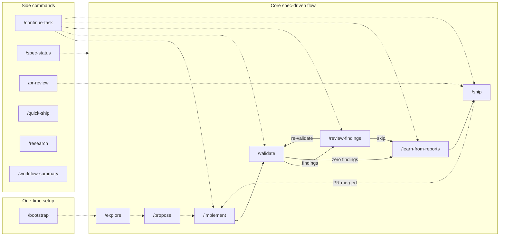
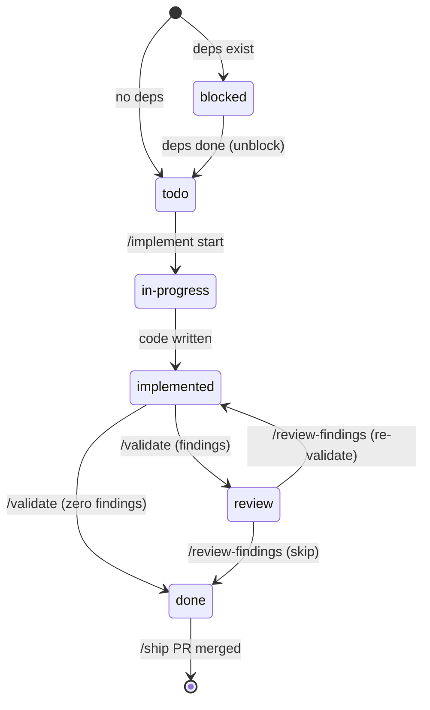
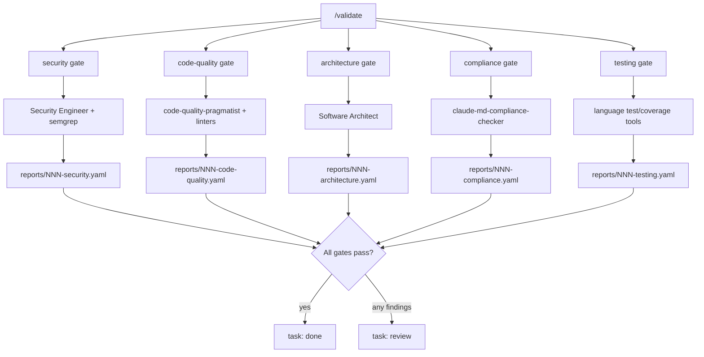
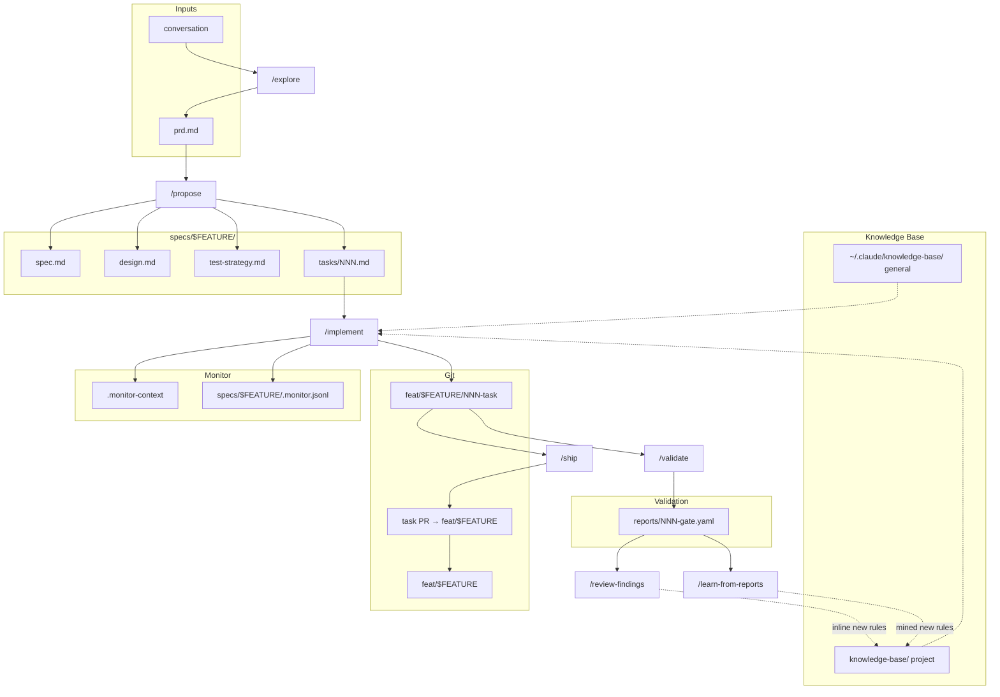
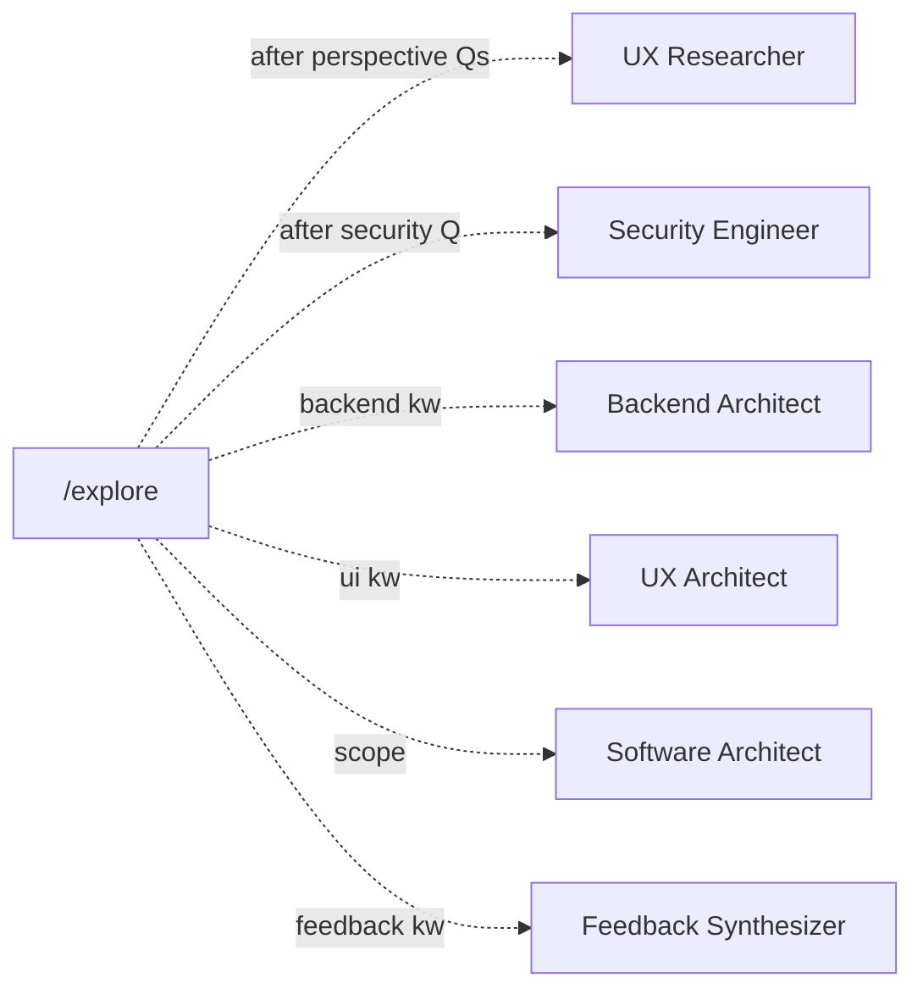
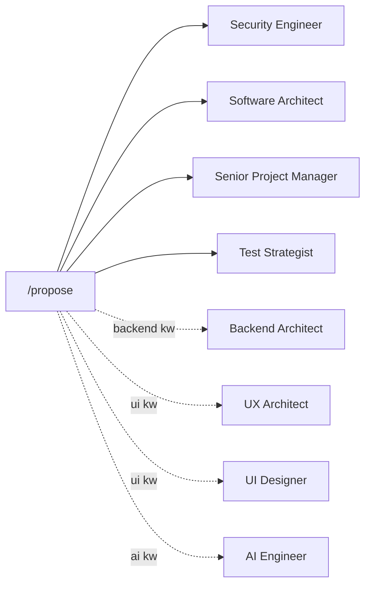
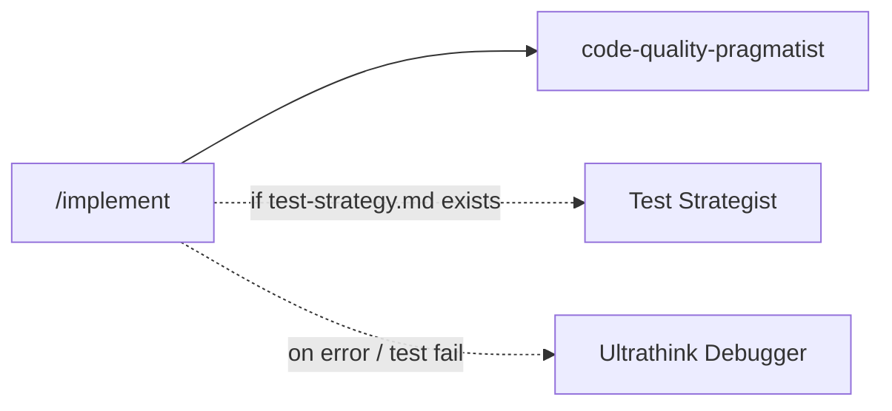
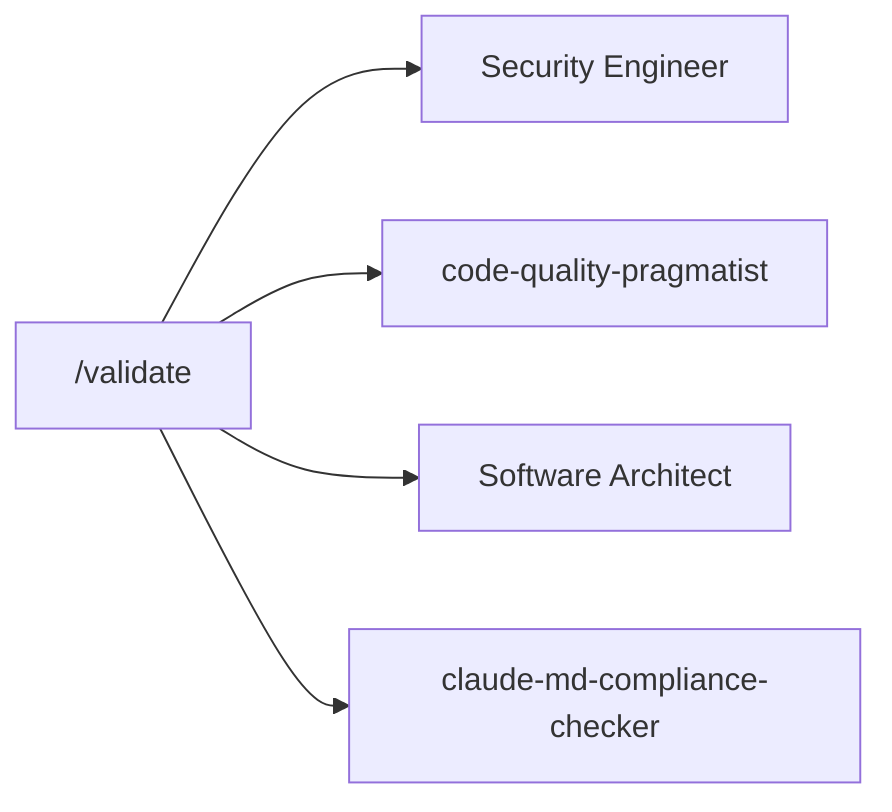
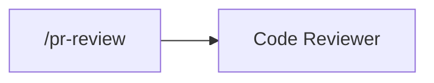
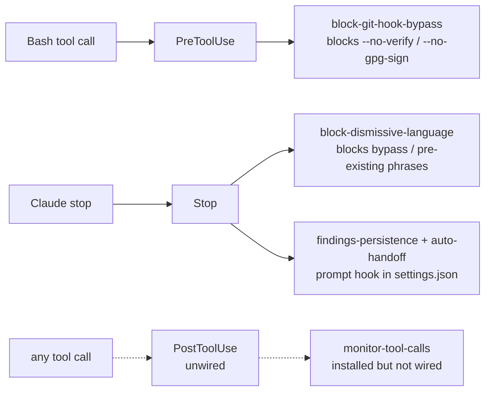

# Workflow Diagrams

Visual map of the spec-driven development workflow: slash commands, agent spawns, hooks, scripts, task state machine, and artifact flow. Read these alongside `onboarding.md` for prose context. Diagrams render inline on GitHub and in Mermaid-capable viewers.

**Legend**
- Solid arrow (`-->`) — automatic / auto-chained transition
- Dashed arrow (`-.->`) — human-gated transition (review, merge, decision)
- Subgraph groups: commands, agents, artifacts, hooks

---

## 1. Command Chain

The core auto-chain (`/implement` → `/validate` → `/review-findings` → `/learn-from-reports` → `/ship`) runs without user intervention between steps. Human gates appear only at PR merge, at finding review, and at rule-candidate review. Side commands (`/spec-status`, `/continue-task`, `/pr-review`, etc.) are invokable anytime.

---

## 2. Task State Machine

Canonical source: `scripts/task-manager.sh:get_allowed_transitions()`. All status changes flow through `task-manager.sh set-status` — never edit task YAML directly.

---

## 3. Validation Gates

`/validate` fans out five gates in parallel. Four are agent-driven (via `Agent` tool); the `testing` gate is deterministic (language tools only, no agent). All-gates rule: every gate must report `status: pass` before task eligible for `done`. Any finding → task moves to `review`.

---

## 4. Artifact Flow

Shows which command produces and consumes each artifact. Two knowledge-base layers (general + project) feed every command. Git branches fan out one PR per task into the feature integration branch.

---

## 5. Command → Agent Spawns

One diagram per command. Solid arrow = always spawned. Dashed arrow = conditional (keyword/context-triggered or error-triggered). Agents listed only for commands that spawn them — other commands (`/bootstrap`, `/ship`, `/quick-ship`, `/spec-status`, `/continue-task`, `/research`, `/workflow-summary`) do not spawn agents directly. `/review-findings` spawns background sub-agents to apply accepted fix groups in parallel (not shown as a separate diagram — the agents are generic fix-appliers, not role-specialized).

### 5a. `/explore` — requirements clarification

### 5b. `/propose` — spec + design + tasks

### 5c. `/implement` — task execution

### 5d. `/validate` — validation gates (parallel)

### 5e. `/pr-review` — PR comment handling

---

## 6. Hooks

Hooks fire on tool events, orthogonal to commands. Block or monitor every tool call.

Notes:
- `scripts/monitor.sh` writes `specs/$FEATURE/.monitor.jsonl` via direct invocation from `/implement`, not a hook.
- `templates/settings.json` wires only `PreToolUse` (Bash) and `Stop`.
- `hooks/monitor-tool-calls.sh` is installed by `setup.sh` as a `PostToolUse` hook but not wired in `templates/settings.json` — pending task tracked in `specs/monitoring-enhancement/prd.md`. When wired, it logs `context_read`, `agent_invocation`, and `tool_call` events to `.monitor.jsonl` automatically.

---

## Key Invariants

- **Serial execution** — one task `in-progress` at a time
- **Auto-chain** — `/implement` drives `/validate` → `/review-findings` → `/ship` without re-prompting
- **All-gates** — all 5 validation gates must pass before `done`
- **Dual KB** — general (`~/.claude/knowledge-base/`) + project (`knowledge-base/`), project overrides general
- **One PR per task** — target is `feat/$FEATURE`, not `main`
- **Ground rules prefix** — `general:...` / `project:...` / unprefixed defaults to project
- **No YAML edits** — all status changes via `task-manager.sh`
- **No bypass** — PreToolUse hook blocks `--no-verify` / `--no-gpg-sign`

## Sources

- `commands/*.md` — command definitions and agent spawns
- `agents/**/*.md` — agent contracts
- `hooks/*.sh` — hook triggers
- `scripts/task-manager.sh` — state machine
- `scripts/monitor.sh` — event logging
- `CLAUDE.md` — design decisions
