# Workflow Diagrams

Visual map of the spec-driven development workflow: slash commands, agent spawns, hooks, scripts, task state machine, and artifact flow. Read these alongside `onboarding.md` for prose context. Diagrams render inline on GitHub and in Mermaid-capable viewers.

**Legend**
- Solid arrow (`-->`) — user-invoked next command (printed as a "Run `/foo`" hint at the previous command's exit)
- Dashed arrow (`-.->`) — human-gated transition (review, merge, decision)
- Subgraph groups: commands, agents, artifacts, hooks

---

## 1. Command Chain

Each command runs only when the user invokes it. There is no auto-chaining between slash commands — every command terminates after its own work and prints the next command to run. The per-task sequence is `/implement` (opens draft PR) → `/pr-review` (optional; loops until PR comments resolved) → `/validate` → (`/review-findings` if findings) → `/learn-from-reports` → `/ship` (marks draft PR ready). Human gates appear at PR comment review (on GitHub), finding review, rule-candidate review, and PR merge. Side commands (`/spec-status`, `/continue-task`, etc.) are invokable anytime.

After `/propose` finishes, the user runs `/validate-spec` — a pre-implementation spec-coherence gate wrapping the `Spec Reviewer` agent. Findings flow through `/review-findings` (also user-invoked) and patch spec/design/tasks (not code). `/implement` is blocked until `specs/<feature>/reports/spec-review.yaml` has `status: pass`.

When the last task in a spec transitions to `done`, `task-manager.sh` emits a `spec_last_task_done` event. `/implement` surfaces this event and instructs the user to run `/validate-impl` (implementation-completion audit via Odium, per ADR-008 of the configurable-workflow spec). Audit verdict `complete` marks the spec shipped; verdict `reopen` routes through `/review-findings`, where each accepted `missing`/`partial` FR finding invokes `task-manager.sh create-followup` to auto-create a `status: todo` follow-up task (FR id validated against `spec.md`, ground_rules inherited from the spec). When the follow-up tasks reach `done`, the T015 detector re-fires `spec_last_task_done` if the user has appended a `spec_reaudit_requested` sentinel via `/validate-impl --reaudit` (event log is append-only — prior `spec_audit_done` is never mutated). Cycle converges when verdict = `complete`.

Under `validate_scope: per-spec` (ADR-007), per-task `/validate` is skipped and the gate union runs once inside `/validate-impl`.

`/explore` step 0 sets `WF_SPEC_TIER` (`small | medium | large`). Tier forks the flow: `small` skips `/validate-spec`, Phase-2 agent gates, and `/validate-impl` (emits `validate_impl_skipped`); `medium` skips `/validate-spec` but runs full per-task gates and `/validate-impl`; `large` is the unchanged full flow. `/implement` step 0 runs `tier-check.sh`; on breach (exit 9) the user picks `Continue` (proceed) or `Abort` → `/promote-tier` → re-runs `/propose` at the next tier (preserved `done`/`implemented` tasks remain).

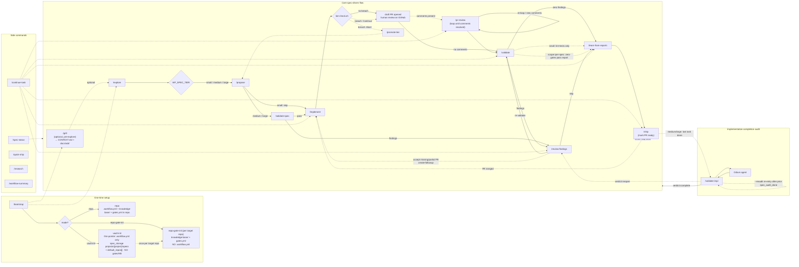
```mermaid
graph LR
    subgraph Setup["One-time setup"]
        BOOT["/bootstrap"]
        STORAGE{mode?}
        REPO_MODE["repo<br/>.workflow.yml + knowledge-base/ + gates.yml in repo"]
        VAULT_INIT["vault-init<br/>thin-pointer .workflow.yml only<br/>spec_storage projects/{project}/specs<br/>+ default_repos[] · NO gates/KB"]
        REPO_GATE["repo-gate-init (per target repo)<br/>knowledge-base/ + gates.yml<br/>NO .workflow.yml"]
        BOOT --> STORAGE
        STORAGE -->|repo| REPO_MODE
        STORAGE -->|vault-init| VAULT_INIT
        STORAGE -->|repo-gate-init| REPO_GATE
        VAULT_INIT -.->|once per target repo| REPO_GATE
    end

    subgraph Core["Core spec-driven flow"]
        GRILL["/grill<br/>(optional, pre-explore)<br/>→ CONTEXT.md + docs/adr/"]
        EXP["/explore"]
        TIER{WF_SPEC_TIER}
        PROP["/propose"]
        VSPEC_PRE["/validate-spec"]
        IMPL["/implement"]
        DPR[draft PR opened<br/>human review on GitHub]
        PRR["/pr-review<br/>(loop until comments resolved)"]
        TCHK{tier-check.sh}
        PROMO["/promote-tier"]
        VAL["/validate"]
        REV["/review-findings"]
        LEARN["/learn-from-reports"]
        SHIP["/ship<br/>(mark PR ready)"]
    end

    subgraph Audit["Implementation-completion audit"]
        VIMPL["/validate-impl"]
        ODIUM["Odium agent"]
    end

    subgraph Side["Side commands"]
        CONT["/continue-task"]
        STAT["/spec-status"]
        QS["/quick-ship"]
        RES["/research"]
        WS["/workflow-summary"]
    end

    BOOT -.-> GRILL
    BOOT -.-> EXP
    GRILL -.->|optional| EXP
    EXP --> TIER
    TIER -->|small / medium / large| PROP
    PROP -->|small: skip| IMPL
    PROP -->|medium / large| VSPEC_PRE
    VSPEC_PRE -->|findings| REV
    VSPEC_PRE -->|pass| IMPL
    IMPL --> TCHK
    TCHK -->|no breach| DPR
    TCHK -.->|breach: Continue| DPR
    TCHK -.->|breach: Abort| PROMO
    PROMO -.-> PROP
    DPR -.->|comments present| PRR
    DPR -->|no comments| VAL
    PRR -->|re-loop / new comments| PRR
    PRR --> VAL
    VAL -->|findings| REV
    VAL -->|zero findings| LEARN
    VAL -.->|small: lint+tests only| LEARN
    VAL -.->|scope=per-spec: zero-gates pass report| LEARN
    REV -->|re-validate| VAL
    REV -->|skip| LEARN
    LEARN --> SHIP
    SHIP -.->|PR merged| IMPL
    SHIP -.->|medium/large: last task done| VIMPL
    SHIP -.->|small: skip audit| Core
    VIMPL --> ODIUM
    ODIUM --> VIMPL
    VIMPL -->|verdict=complete| Core
    VIMPL -.->|verdict=reopen| REV
    VIMPL -.->|--reaudit re-entry after prior spec_audit_done| VIMPL
    REV -.->|accept missing/partial FR<br/>create-followup| IMPL

    CONT -.-> IMPL
    CONT -.-> VAL
    CONT -.-> REV
    CONT -.-> LEARN
    CONT -.-> SHIP
    CONT -.-> PRR
    STAT -.-> Core
```

### `/fix` — bug-fix flow

Standalone entry. Bypasses `/explore`, `/propose`, `/validate-spec`, `/validate-impl`, and the tier system. Artifact: `specs/fixes/<slug>/fix.md`.

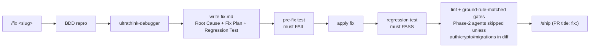
```mermaid
graph LR
    FIX["/fix &lt;slug&gt;"] --> REPRO[BDD repro]
    REPRO --> UD[ultrathink-debugger]
    UD --> FIXMD[write fix.md<br/>Root Cause + Fix Plan + Regression Test]
    FIXMD --> PRE[pre-fix test<br/>must FAIL]
    PRE --> APPLY[apply fix]
    APPLY --> POST[regression test<br/>must PASS]
    POST --> GATES[lint + ground-rule-matched gates<br/>Phase-2 agents skipped unless<br/>auth/crypto/migrations in diff]
    GATES --> SH["/ship (PR title: fix:)"]
```

---

## 2. Task State Machine

Canonical source: `scripts/task-manager.sh:get_allowed_transitions()`. All status changes flow through `task-manager.sh set-status` — never edit task YAML directly.

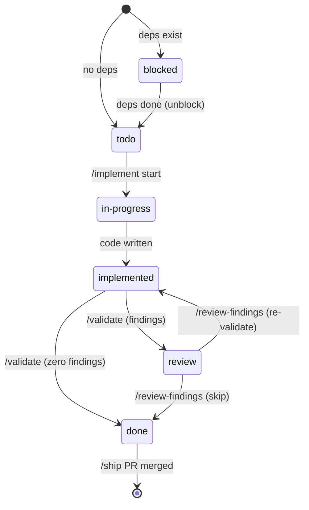
```mermaid
stateDiagram-v2
    state "in-progress" as in_progress
    [*] --> blocked: deps exist
    [*] --> todo: no deps
    blocked --> todo: deps done (unblock)
    todo --> in_progress: /implement start
    in_progress --> implemented: code written
    implemented --> review: /validate (findings)
    implemented --> done: /validate (zero findings)
    review --> implemented: /review-findings (re-validate)
    review --> done: /review-findings (skip)
    done --> [*]: /ship PR merged
```

---

## 3. Validation Gates

`/validate` fans out gates in parallel. Four are agent-driven (via `Agent` tool); the `testing` gate is deterministic (language tools only, no agent). All-gates rule: every gate must report `status: pass` before task eligible for `done`. Any finding → task moves to `review`.

**Phase 1** computes the effective gate set as `WF_SPEC_GATES ∩ language-applicable gates from gates.yml` (ceiling intersection). Gates outside the intersection emit a `gate_skip` event and are not run.

**Phase 2** reads the agent list from `WF_SPEC_AGENTS_VALIDATE` (set by config.yml) — not a hardcoded list. Each entry spawns one agent.

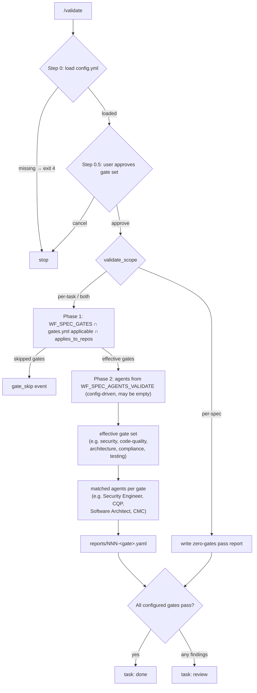
```mermaid
graph TD
    V["/validate"] --> CFG0{Step 0: load config.yml}
    CFG0 -->|missing → exit 4| STOP_V[stop]
    CFG0 -->|loaded| APPR{Step 0.5: user approves gate set}
    APPR -->|cancel| STOP_V
    APPR -->|approve| SCOPE{validate_scope}
    SCOPE -->|per-spec| PASS[write zero-gates pass report]
    SCOPE -->|per-task / both| CEIL["Phase 1: WF_SPEC_GATES ∩ gates.yml applicable ∩ applies_to_repos"]
    CEIL -->|skipped gates| SKIP[gate_skip event]
    CEIL -->|effective gates| AGT["Phase 2: agents from WF_SPEC_AGENTS_VALIDATE (config-driven, may be empty)"]

    AGT --> GATES["effective gate set<br/>(e.g. security, code-quality,<br/>architecture, compliance, testing)"]
    GATES --> AGENTS["matched agents per gate<br/>(e.g. Security Engineer, CQP,<br/>Software Architect, CMC)"]
    AGENTS --> REPORTS[reports/NNN-&lt;gate&gt;.yaml]

    REPORTS --> AGG{All configured gates pass?}
    PASS --> AGG
    AGG -->|yes| DONE[task: done]
    AGG -->|any findings| REVIEW[task: review]
```

---

## 4. Artifact Flow

Shows which command produces and consumes each artifact. Two knowledge-base layers (general + project) feed every command. Git branches fan out one PR per task into the feature integration branch.

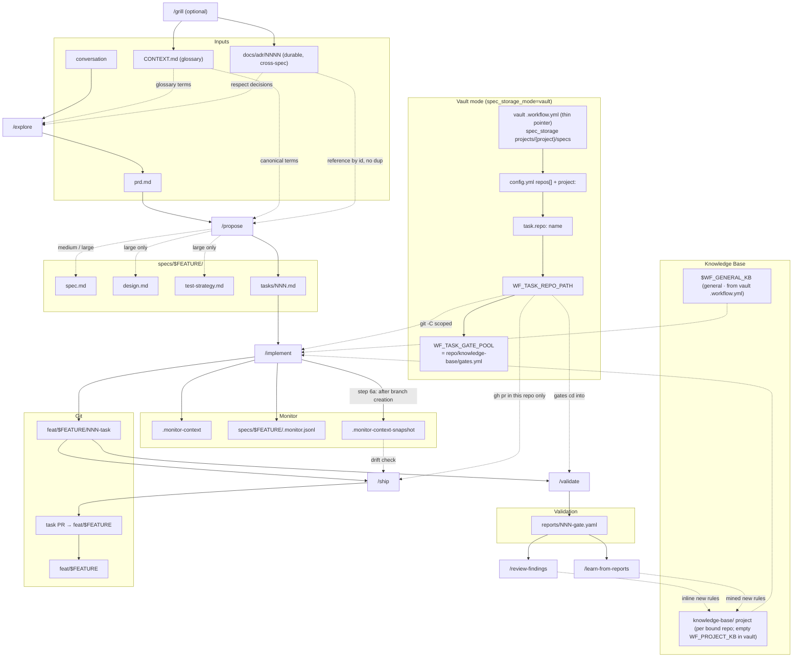
```mermaid
graph TB
    subgraph Inputs
        CONV[conversation]
        PRD[prd.md]
        CTXMD["CONTEXT.md (glossary)"]
        ADR["docs/adr/NNNN (durable, cross-spec)"]
    end

    subgraph Specs["specs/$FEATURE/"]
        SPEC[spec.md]
        DESIGN[design.md]
        TS[test-strategy.md]
        TASKS[tasks/NNN.md]
    end

    subgraph Validation
        REPORTS[reports/NNN-gate.yaml]
    end

    subgraph KB["Knowledge Base"]
        GKB["$WF_GENERAL_KB (general · from vault .workflow.yml)"]
        PKB["knowledge-base/ project (per bound repo; empty WF_PROJECT_KB in vault)"]
    end

    subgraph Git
        FEAT[feat/$FEATURE]
        TBR[feat/$FEATURE/NNN-task]
        PR[task PR → feat/$FEATURE]
    end

    subgraph MultiRepo["Vault mode (spec_storage_mode=vault)"]
        THIN["vault .workflow.yml (thin pointer)<br/>spec_storage projects/{project}/specs"]
        REPOS["config.yml repos[] + project:"]
        TASK_REPO[task.repo: name]
        WTRP[WF_TASK_REPO_PATH]
        WTGP["WF_TASK_GATE_POOL<br/>= repo/knowledge-base/gates.yml"]
        THIN --> REPOS
        REPOS --> TASK_REPO
        TASK_REPO --> WTRP
        WTRP --> WTGP
    end

    subgraph Monitor
        CTX[.monitor-context]
        JSONL[specs/$FEATURE/.monitor.jsonl]
        SNAP[.monitor-context-snapshot]
    end

    GR["/grill (optional)"] --> CTXMD
    GR --> ADR
    CONV --> EX["/explore"]
    CTXMD -.->|glossary terms| EX
    ADR -.->|respect decisions| EX
    EX --> PRD
    PRD --> PP["/propose"]
    CTXMD -.->|canonical terms| PP
    ADR -.->|reference by id, no dup| PP
    PP --> TASKS
    PP -.->|medium / large| SPEC
    PP -.->|large only| DESIGN
    PP -.->|large only| TS

    TASKS --> IM["/implement"]
    GKB -.-> IM
    PKB -.-> IM
    IM --> TBR
    IM --> CTX
    IM --> JSONL
    IM -->|step 6a: after branch creation| SNAP

    TBR --> VA["/validate"]
    VA --> REPORTS
    REPORTS --> RF["/review-findings"]
    RF -.->|inline new rules| PKB
    REPORTS --> LFR["/learn-from-reports"]
    LFR -.->|mined new rules| PKB

    TBR --> SH["/ship"]
    SNAP -.->|drift check| SH
    SH --> PR
    PR --> FEAT
    WTRP -.->|git -C scoped| IM
    WTRP -.->|gates cd into| VA
    WTRP -.->|gh pr in this repo only| SH
```

---

## 5. Command → Agent Spawns

One diagram per command. Solid arrow = always spawned. Dashed arrow = conditional (keyword/context-triggered or error-triggered). Agents listed only for commands that spawn them — other commands (`/bootstrap`, `/ship`, `/quick-ship`, `/spec-status`, `/continue-task`, `/research`, `/workflow-summary`) do not spawn agents directly. `/review-findings` spawns background sub-agents to apply accepted fix groups in parallel (not shown as a separate diagram — the agents are generic fix-appliers, not role-specialized).

### 5a-pre. `/grill` — optional pre-explore domain sharpening

No role-specialized agent spawn. `/grill` itself runs the relentless
one-question-at-a-time interview, exploring the codebase to answer questions it
can, and writes `CONTEXT.md` + `docs/adr/` inline. Optional; typically skipped
for `small` tier. Feeds canonical vocabulary into `/explore` and `/propose`.

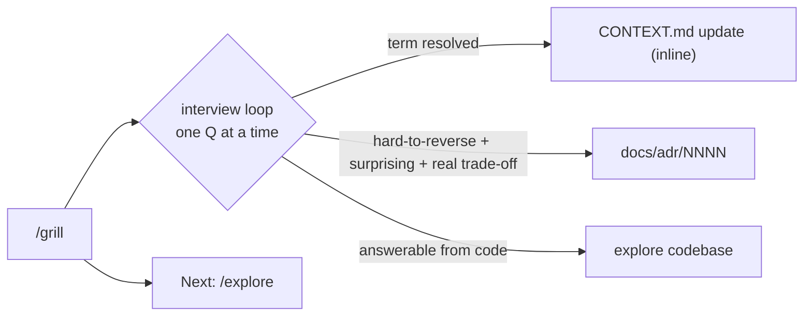
```mermaid
graph LR
    GR["/grill"] --> Q{interview loop<br/>one Q at a time}
    Q -->|term resolved| CTXW["CONTEXT.md update (inline)"]
    Q -->|hard-to-reverse + surprising + real trade-off| ADRW["docs/adr/NNNN"]
    Q -->|answerable from code| CODE[explore codebase]
    GR --> NEXT["Next: /explore"]
```

### 5a. `/explore` — requirements clarification

Step 0 runs before any perspective questions: the `config-inferencer` agent drafts `config.yml` (gates + agents-per-phase) from repo signal files. User approves (single key) or edits via `/config`. `config.yml` is written before the normal explore flow begins.

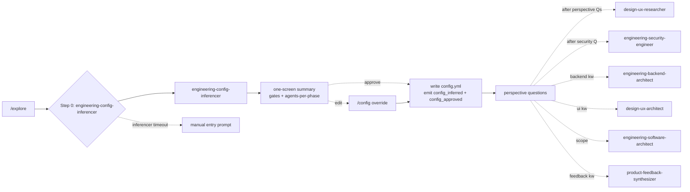
```mermaid
graph LR
    EX["/explore"] --> S0{Step 0: engineering-config-inferencer}
    S0 --> CI[engineering-config-inferencer]
    CI --> SUMMARY[one-screen summary\ngates + agents-per-phase]
    SUMMARY -.->|approve| WRITE[write config.yml\nemit config_inferred + config_approved]
    SUMMARY -.->|edit| CFG["/config override"]
    CFG --> WRITE
    WRITE --> PERSP[perspective questions]
    PERSP -.->|after perspective Qs| UXR[design-ux-researcher]
    PERSP -.->|after security Q| SE[engineering-security-engineer]
    PERSP -.->|backend kw| BA[engineering-backend-architect]
    PERSP -.->|ui kw| UXA[design-ux-architect]
    PERSP -.->|scope| SA[engineering-software-architect]
    PERSP -.->|feedback kw| FS[product-feedback-synthesizer]
    S0 -.->|inferencer timeout| MANUAL[manual entry prompt]
```

### 5b. `/propose` — spec + design + tasks

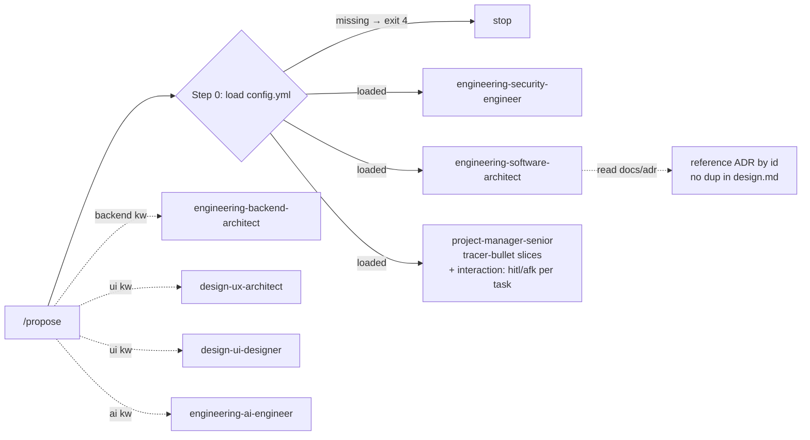
```mermaid
graph LR
    PR["/propose"] --> CFG0{Step 0: load config.yml}
    CFG0 -->|missing → exit 4| STOP_PR[stop]
    CFG0 -->|loaded| SE[engineering-security-engineer]
    CFG0 -->|loaded| SA[engineering-software-architect]
    CFG0 -->|loaded| SPM[project-manager-senior<br/>tracer-bullet slices<br/>+ interaction: hitl/afk per task]
    SA -.->|read docs/adr| ADRREF[reference ADR by id<br/>no dup in design.md]
    PR -.->|backend kw| BA[engineering-backend-architect]
    PR -.->|ui kw| UXA[design-ux-architect]
    PR -.->|ui kw| UID[design-ui-designer]
    PR -.->|ai kw| AIE[engineering-ai-engineer]
```

### 5c. `/implement` — task execution

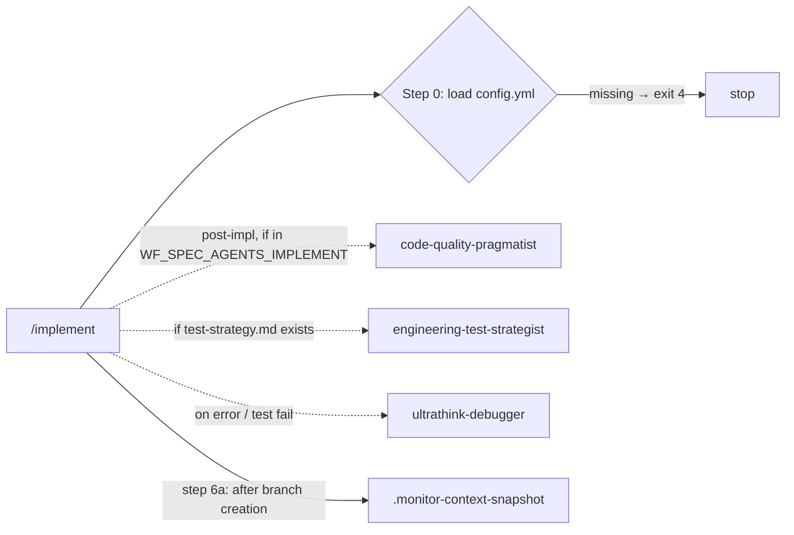
```mermaid
graph LR
    IM["/implement"] --> CFG0{Step 0: load config.yml}
    CFG0 -->|missing → exit 4| STOP_IM[stop]
    IM -.->|post-impl, if in WF_SPEC_AGENTS_IMPLEMENT| CQP[code-quality-pragmatist]
    IM -.->|if test-strategy.md exists| TSG[engineering-test-strategist]
    IM -.->|on error / test fail| UD[ultrathink-debugger]
    IM -->|step 6a: after branch creation| SNAP[.monitor-context-snapshot]
```

### 5d. `/validate` — validation gates (parallel)

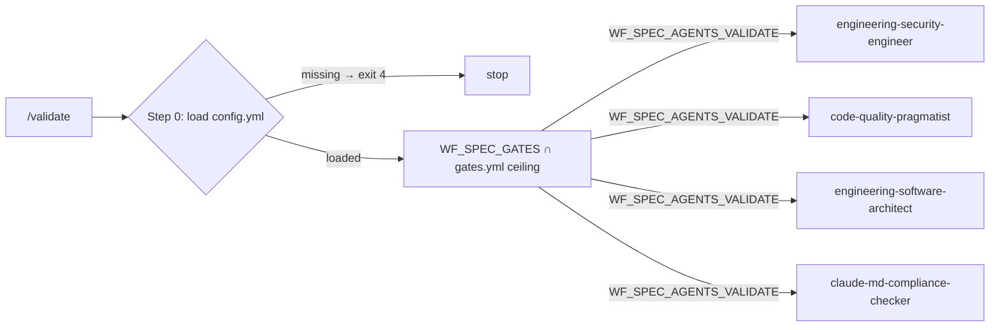
```mermaid
graph LR
    VA["/validate"] --> CFG0{Step 0: load config.yml}
    CFG0 -->|missing → exit 4| STOP_VA[stop]
    CFG0 -->|loaded| CEIL["WF_SPEC_GATES ∩ gates.yml ceiling"]
    CEIL -->|WF_SPEC_AGENTS_VALIDATE| SE[engineering-security-engineer]
    CEIL -->|WF_SPEC_AGENTS_VALIDATE| CQP[code-quality-pragmatist]
    CEIL -->|WF_SPEC_AGENTS_VALIDATE| SA[engineering-software-architect]
    CEIL -->|WF_SPEC_AGENTS_VALIDATE| CMC[claude-md-compliance-checker]
```

### 5e. `/pr-review` — PR comment handling

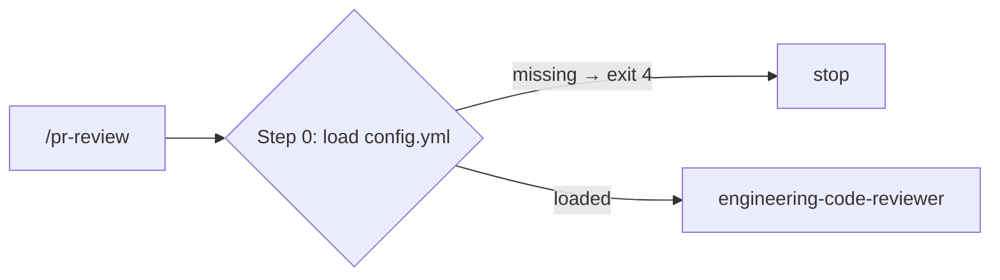
```mermaid
graph LR
    PRR["/pr-review"] --> CFG0{Step 0: load config.yml}
    CFG0 -->|missing → exit 4| STOP_PRR[stop]
    CFG0 -->|loaded| CR[engineering-code-reviewer]
```

### 5f. `/validate-spec` — pre-implementation spec coherence

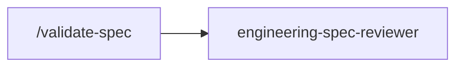
```mermaid
graph LR
    VSPEC["/validate-spec"] --> SR[engineering-spec-reviewer]
```

### 5g. `/validate-impl` — implementation-completion audit

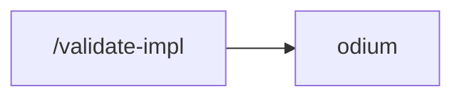
```mermaid
graph LR
    VIMPL["/validate-impl"] --> ODIUM[odium]
```

### 5h. `/review-findings` — finding triage

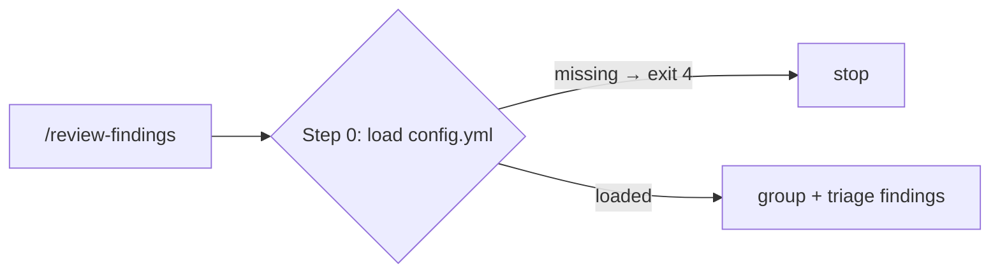
```mermaid
graph LR
    RF["/review-findings"] --> CFG0{Step 0: load config.yml}
    CFG0 -->|missing → exit 4| STOP_RF[stop]
    CFG0 -->|loaded| TRIAGE[group + triage findings]
```

### 5i. `/ship` — commit, push, PR

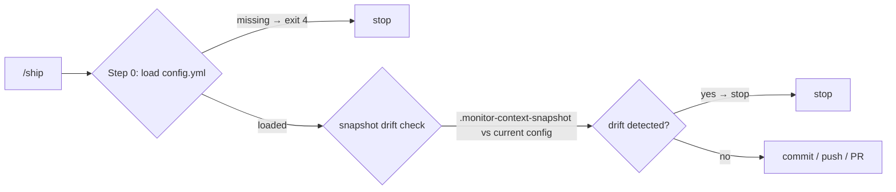
```mermaid
graph LR
    SH["/ship"] --> CFG0{Step 0: load config.yml}
    CFG0 -->|missing → exit 4| STOP_SH[stop]
    CFG0 -->|loaded| DRIFT{snapshot drift check}
    DRIFT -->|.monitor-context-snapshot vs current config| DRIFT_DEC{drift detected?}
    DRIFT_DEC -->|yes → stop| STOP_DRIFT[stop]
    DRIFT_DEC -->|no| COMMIT[commit / push / PR]
```

---

## 6. Hooks

Hooks fire on tool events, orthogonal to commands. Block or monitor every tool call.

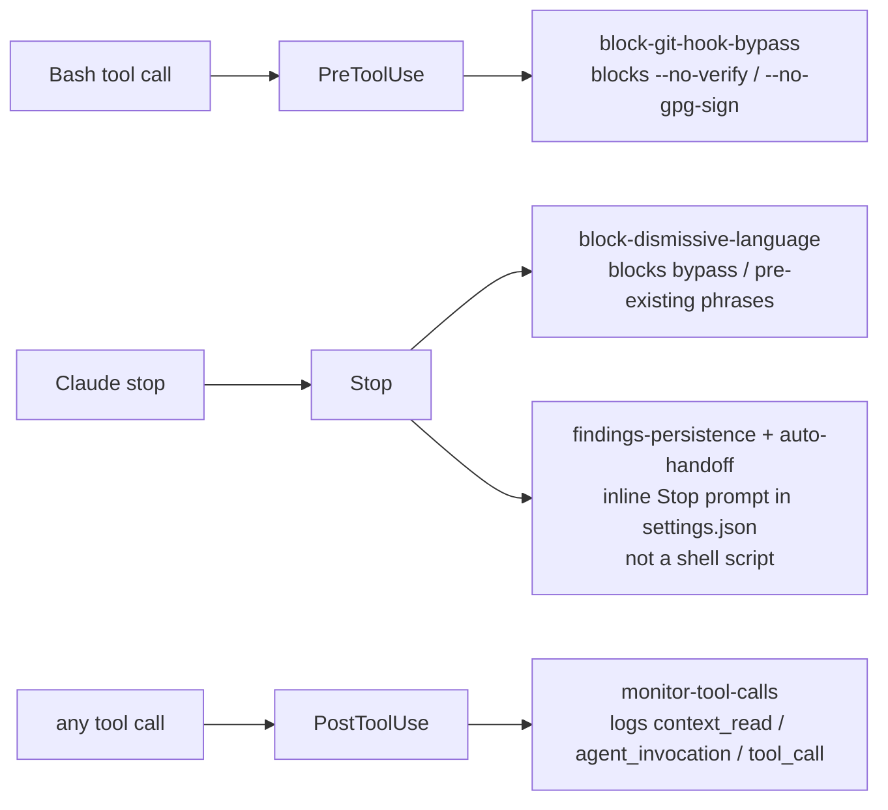
```mermaid
graph LR
    TOOL[Bash tool call] --> PRE[PreToolUse]
    STOP_EVT[Claude stop] --> STOPH[Stop]
    POST_EVT[any tool call] --> POST[PostToolUse]

    PRE --> H1[block-git-hook-bypass<br/>blocks --no-verify / --no-gpg-sign]
    STOPH --> H2[block-dismissive-language<br/>blocks bypass / pre-existing phrases]
    STOPH --> H3[findings-persistence + auto-handoff<br/>inline Stop prompt in settings.json<br/>not a shell script]
    POST --> H4[monitor-tool-calls<br/>logs context_read / agent_invocation / tool_call]
```

Notes:
- `scripts/monitor.sh` writes `specs/$FEATURE/.monitor.jsonl` via direct invocation from `/implement`, not a hook.
- `templates/settings.json` wires `PreToolUse` (Bash), `PostToolUse` (all tools), and `Stop`.
- `hooks/monitor-tool-calls.sh` runs as `PostToolUse` and logs `context_read`, `agent_invocation`, and `tool_call` events to `.monitor.jsonl`.

---

## Key Invariants

- **Serial execution** — one task `in-progress` at a time
- **Per-task sequence** — `/implement` (opens draft PR) → `/pr-review` (optional loop) → `/validate` → (`/review-findings` if findings) → `/learn-from-reports` → `/ship` (marks PR ready), each invoked explicitly by the user
- **All-gates** — all configured validation gates (from `WF_SPEC_AGENTS_VALIDATE` ∩ ceiling) must pass before `done`
- **Dual KB** — general (`$WF_GENERAL_KB`) + project (`knowledge-base/`), project overrides general
- **One PR per task** — target is `feat/$FEATURE`, not `main`
- **Ground rules prefix** — `general:...` / `project:...` / `repo:<name>:...`. Vault single-repo: unprefixed/`project:` → the sole bound repo. Vault 2+ repos: bare rejected (exit 7), require `general:`/`repo:<name>:`.
- **Vault mode** — `spec_storage_mode: vault` + thin-pointer `.workflow.yml` (workflow settings + `general_kb_path` only; no vault gates/KB). `spec_storage` uses `{project}` token. Per-spec `repos[]` bind code repos; gates/KB resolve per-task from the bound repo (`WF_TASK_REPO_PATH`, `WF_TASK_GATE_POOL`). One task = one repo. PR opens in that repo's remote only. `/bootstrap`: vault-init once + repo-gate-init per target repo.
- **No YAML edits** — all status changes via `task-manager.sh`
- **No bypass** — PreToolUse hook blocks `--no-verify` / `--no-gpg-sign`

## Sources

- `commands/*.md` — command definitions and agent spawns
- `agents/**/*.md` — agent contracts
- `hooks/*.sh` — hook triggers
- `scripts/task-manager.sh` — state machine
- `scripts/monitor.sh` — event logging
- `CLAUDE.md` — design decisions
