# Workflow Diagrams

Visual map of the spec-driven development workflow: slash commands, agent spawns, hooks, scripts, task state machine, and artifact flow. Read these alongside `onboarding.md` for prose context. Diagrams render inline on GitHub and in Mermaid-capable viewers.

**Legend**
- Solid arrow (`-->`) — user-invoked next command (printed as a "Run `/foo`" hint at the previous command's exit)
- Dashed arrow (`-.->`) — human-gated transition (review, merge, decision)
- Subgraph groups: commands, agents, artifacts, hooks

---

## 1. Command Chain

Each command runs only when the user invokes it. There is no auto-chaining between slash commands — every command terminates after its own work and prints the next command to run. **Shipping is a shared inline procedure (`scripts/ship-procedure.md`), not a command** — it runs inline at the two terminal points of the per-task flow, so the "no auto-chaining" rule still holds. The per-task sequence is `/implement` (opens draft PR) → `/pr-review` (optional; loops until PR comments resolved) → `/validate` (zero findings → ships inline, marks PR ready) → (`/review-and-ship` if findings — addresses them, then ships inline) → `/learn-from-reports` (final manual step; task already shipped) → merge PR → `/implement` (next task). Reaching `done` coincides with shipping. Human gates appear at PR comment review (on GitHub), finding review, rule-candidate review, and PR merge. Side commands (`/spec-status`, `/continue-task`, etc.) are invokable anytime.

When the last task in a spec transitions to `done`, `task-manager.sh` emits a `spec_last_task_done` event. `/implement` surfaces this event and instructs the user to run `/validate-impl` (implementation-completion audit via Odium, per ADR-008 of the configurable-workflow spec). Audit verdict `complete` marks the spec done; verdict `reopen` routes through `/review-and-ship` (spec-level triage — no task in `review`, so its ship tail is a no-op), where each accepted `missing`/`partial` FR finding invokes `task-manager.sh create-followup` to auto-create a `status: todo` follow-up task (FR id validated against `spec.md`, ground_rules inherited from the spec). When the follow-up tasks reach `done`, the T015 detector re-fires `spec_last_task_done` if the user has appended a `spec_reaudit_requested` sentinel via `/validate-impl --reaudit` (event log is append-only — prior `spec_audit_done` is never mutated). Cycle converges when verdict = `complete`.

Under `validate_scope: per-spec` (ADR-007), per-task `/validate` is skipped and the gate union runs once inside `/validate-impl`.

`/explore` step 0 sets `WF_SPEC_TIER` (`small | medium | large`). Tier forks the flow: `small` skips Phase-2 agent gates and `/validate-impl` (emits `validate_impl_skipped`); `medium` runs full per-task gates and `/validate-impl`; `large` is the unchanged full flow. `/implement` step 0 runs `tier-check.sh`; on breach (exit 9) the user picks `Continue` (proceed) or `Abort` → `/promote-tier` → re-runs `/propose` at the next tier (preserved `done`/`implemented` tasks remain).

`/explore` step 0 also sets `WF_SPEC_TRACK` (`feature` default | `technical`), orthogonal to tier. On the **technical track** `/propose` writes **tasks/ only at every tier** (no spec.md/design.md/test-strategy.md; rationale comes from `docs/adr/` + `CONTEXT.md`), and hard-refuses for `medium`/`large` until the `/explore` Step −1 grill pass has produced a non-empty `docs/adr/` (`small` is exempt). Per-task `technical_acceptance` seeds the `/implement` TDD backlog; `/validate-impl` adds an advisory finding if those items lack red→green evidence. All other flow (validate gates, state machine, ship) is unchanged.

`/explore` step 0 also sets `WF_BRANCH_STRATEGY` (`per-task` default | `single-branch`), orthogonal to tier/track. Under **per-task** the chain is unchanged: per-task sub-branch, draft PR, `/pr-review`, one PR per task into `feat/$FEATURE`. Under **single-branch** there is no per-task sub-branch and **no draft PR** — `/implement` → `tier-check` → `/validate` directly (no DPR/PRR node); commits accumulate on `feat/$FEATURE` with a per-task `task_base_sha`; the serial gate is "preceding task `done`". On a **non-last** task the inline ship only pushes (→ `/implement` next); on the **last** task it opens/readies **one spec PR with base `main`**. `/pr-review` mid-spec is an intended clean dead-end. See `docs/adr/0003-branch-strategy.md`. (ADR-0003)

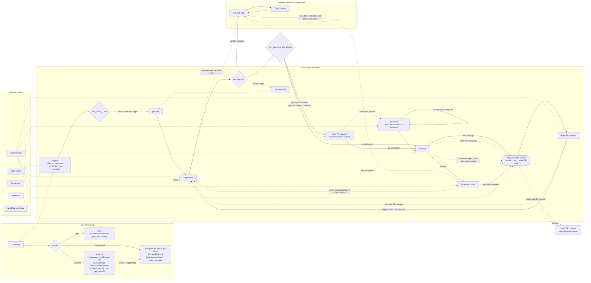
```mermaid
graph LR
    subgraph Setup["One-time setup"]
        BOOT["/bootstrap"]
        STORAGE{mode?}
        REPO_MODE["repo<br/>.workflow.yml with inline gate_pool: in repo"]
        VAULT_INIT["vault-init<br/>thin-pointer .workflow.yml only<br/>spec_storage projects/{project}/specs<br/>+ default_repos[] · NO gate_pool/KB"]
        REPO_GATE["repo-gate-init (per target repo)<br/>thin .workflow.yml<br/>kind: repo-gate-pool · gate_pool: only"]
        BOOT --> STORAGE
        STORAGE -->|repo| REPO_MODE
        STORAGE -->|vault-init| VAULT_INIT
        STORAGE -->|repo-gate-init| REPO_GATE
        VAULT_INIT -.->|once per target repo| REPO_GATE
    end

    subgraph Core["Core spec-driven flow"]
        EXP["/explore<br/>(Step −1: grill pass<br/>→ CONTEXT.md + docs/adr/)"]
        TIER{WF_SPEC_TIER}
        PROP["/propose"]
        IMPL["/implement"]
        DPR[draft PR opened<br/>human review on GitHub]
        PRR["/pr-review<br/>(loop until comments resolved)"]
        TCHK{tier-check.sh}
        PROMO["/promote-tier"]
        VAL["/validate"]
        REV["/review-and-ship"]
        SHIPPROC(["ship procedure (inline)<br/>commit · push · mark PR ready"])
        LEARN["/learn-from-reports"]
    end

    subgraph Audit["Implementation-completion audit"]
        VIMPL["/validate-impl"]
        ODIUM["Odium agent"]
    end

    subgraph Side["Side commands"]
        CONT["/continue-task"]
        STAT["/spec-status"]
        QS["/quick-ship"]
        RES["/research"]
        WS["/workflow-summary"]
    end

    BOOT -.-> EXP
    EXP --> TIER
    TIER -->|small / medium / large| PROP
    PROP --> IMPL
    IMPL --> TCHK
    TCHK --> BSTR{WF_BRANCH_STRATEGY}
    TCHK -.->|breach: Abort| PROMO
    PROMO -.-> PROP
    BSTR -->|per-task: no breach| DPR
    BSTR -.->|per-task: breach Continue| DPR
    BSTR -->|single-branch| VAL
    DPR -.->|comments present| PRR
    DPR -->|no comments| VAL
    PRR -->|re-loop / new comments| PRR
    PRR --> VAL
    VAL -->|findings| REV
    VAL -->|zero findings| SHIPPROC
    VAL -.->|small: lint+tests only| SHIPPROC
    VAL -.->|scope=per-spec: zero-gates pass report| SHIPPROC
    REV -->|task was at review| SHIPPROC
    SHIPPROC --> LEARN
    SHIPPROC -.->|single-branch: last task| SBPR2["spec PR → main<br/>opened/readied once"]
    SBPR2 -.->|merged| Core
    LEARN -.->|per-task: PR merged| IMPL
    LEARN -->|single-branch: non-last task| IMPL
    IMPL -.->|medium/large: last task done| VIMPL
    IMPL -.->|small: skip audit| Core
    VIMPL --> ODIUM
    ODIUM --> VIMPL
    VIMPL -->|verdict=complete| Core
    VIMPL -.->|verdict=reopen| REV
    VIMPL -.->|--reaudit re-entry after prior spec_audit_done| VIMPL
    REV -.->|accept missing/partial FR<br/>create-followup| IMPL

    CONT -.-> IMPL
    CONT -.-> VAL
    CONT -.-> REV
    CONT -.-> LEARN
    CONT -.-> SHIPPROC
    CONT -.-> PRR
    STAT -.-> Core
```

### `/fix` — bug-fix flow

Standalone entry. Bypasses `/explore`, `/propose`, `/validate-impl`, and the tier system. Artifact: `specs/fixes/<slug>/fix.md`. Steps 4–5 are test-driven via the `tdd` skill (tracer-bullet RED→GREEN, then refactor).

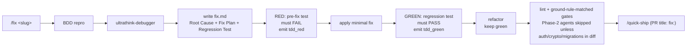
```mermaid
graph LR
    FIX["/fix &lt;slug&gt;"] --> REPRO[BDD repro]
    REPRO --> UD[ultrathink-debugger]
    UD --> FIXMD[write fix.md<br/>Root Cause + Fix Plan + Regression Test]
    FIXMD --> RED[RED: pre-fix test<br/>must FAIL<br/>emit tdd_red]
    RED --> APPLY[apply minimal fix]
    APPLY --> GREEN[GREEN: regression test<br/>must PASS<br/>emit tdd_green]
    GREEN --> REFACTOR[refactor<br/>keep green]
    REFACTOR --> GATES[lint + ground-rule-matched gates<br/>Phase-2 agents skipped unless<br/>auth/crypto/migrations in diff]
    GATES --> SH["/quick-ship (PR title: fix:)"]
```

---

## 2. Task State Machine

Canonical source: `scripts/task-manager.sh:get_allowed_transitions()`. All status changes flow through `task-manager.sh set-status` — never edit task YAML directly.

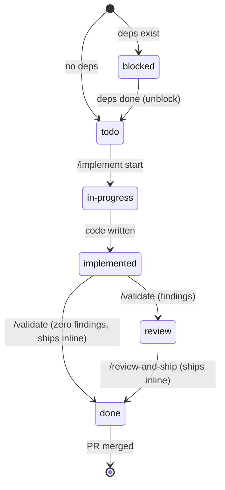
```mermaid
stateDiagram-v2
    state "in-progress" as in_progress
    [*] --> blocked: deps exist
    [*] --> todo: no deps
    blocked --> todo: deps done (unblock)
    todo --> in_progress: /implement start
    in_progress --> implemented: code written
    implemented --> review: /validate (findings)
    implemented --> done: /validate (zero findings, ships inline)
    review --> done: /review-and-ship (ships inline)
    done --> [*]: PR merged
```

---

## 3. Validation Gates

`/validate` fans out gates in parallel. Deterministic gates (lint, typecheck, `testing`) run via the `gate-runner` subagent (language tools only); advisory gates are agent-driven (via `Agent` tool). All-gates rule: every gate must report `status: pass` before task eligible for `done`. Any finding → task moves to `review`.

**Phase 1** computes the effective gate set as `WF_SPEC_GATES ∩ language-applicable gates from .workflow.yml gate_pool` (ceiling intersection). Gates outside the intersection emit a `gate_skip` event and are not run. Resolution (effective-set, skip events, scope short-circuit, empty-set fail-closed) stays in the main session; **execution is delegated to the `gate-runner` subagent** — one subagent runs the whole effective set, converts each gate's output to the report schema, writes `reports/<task-id>-<gate>.yaml` itself, and returns only a compact verdict, so raw lint/test output never enters the main session.

**Phase 2** reads the agent list from `WF_SPEC_AGENTS_VALIDATE` (set by config.yml) — not a hardcoded list. Each entry spawns one agent.

**Phase 3** (per-task coverage audit) reuses **Odium** to check the task diff against the task's own acceptance criteria. Advisory — gaps land in `reports/<task-id>-coverage.yaml` (just another gate report into AGG). Skipped (first match) on `tier_small` / `config_off` (`coverage_audit: false`) / `scope=per-spec`, each emitting a `gate_skip` event (`gate: coverage`); otherwise emits `coverage_audit_start` + `coverage_audit_done`.

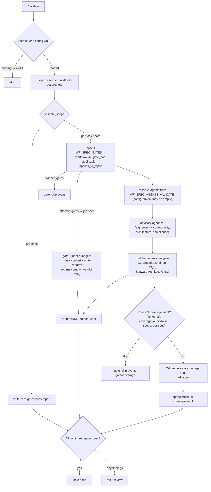
```mermaid
graph TD
    V["/validate"] --> CFG0{Step 0: load config.yml}
    CFG0 -->|missing → exit 4| STOP_V[stop]
    CFG0 -->|loaded| APPR[Step 0.5: render validation-set preview]
    APPR --> SCOPE{validate_scope}
    SCOPE -->|per-spec| PASS[write zero-gates pass report]
    SCOPE -->|per-task / both| CEIL["Phase 1: WF_SPEC_GATES ∩ .workflow.yml gate_pool applicable ∩ applies_to_repos"]
    CEIL -->|skipped gates| SKIP[gate_skip event]
    CEIL -->|effective gates → job spec| GR["gate-runner subagent<br/>(run + convert + write reports;<br/>returns compact verdict only)"]
    GR --> REPORTS[reports/NNN-&lt;gate&gt;.yaml]
    CEIL --> AGT["Phase 2: agents from WF_SPEC_AGENTS_VALIDATE (config-driven, may be empty)"]

    AGT --> GATES["advisory agent set<br/>(e.g. security, code-quality,<br/>architecture, compliance)"]
    GATES --> AGENTS["matched agents per gate<br/>(e.g. Security Engineer, CQP,<br/>Software Architect, CMC)"]
    AGENTS --> REPORTS

    AGENTS --> COVGATE{"Phase 3 coverage audit?<br/>(tier≠small, coverage_audit≠false, scope≠per-spec)"}
    COVGATE -->|skip| COVSKIP[gate_skip event: gate=coverage]
    COVGATE -->|run| COV["Odium per-task coverage audit<br/>(advisory)"]
    COV --> COVREP["reports/&lt;task-id&gt;-coverage.yaml"]
    COVREP --> AGG

    REPORTS --> AGG{All configured gates pass?}
    PASS --> AGG
    AGG -->|yes| DONE[task: done]
    AGG -->|any findings| REVIEW[task: review]
```

---

## 4. Artifact Flow

Shows which command produces and consumes each artifact. One knowledge base (`$WF_GENERAL_KB`) feeds every command. Git branches fan out one PR per task into the feature integration branch.

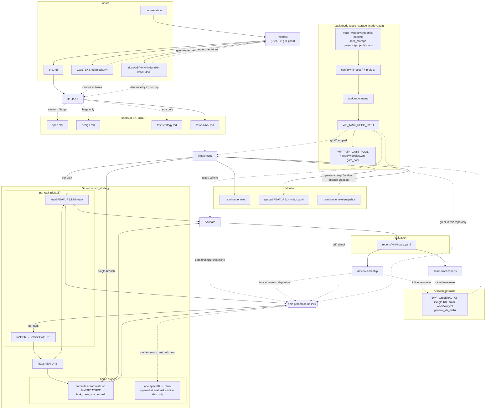
```mermaid
graph TB
    subgraph Inputs
        CONV[conversation]
        PRD[prd.md]
        CTXMD["CONTEXT.md (glossary)"]
        ADR["docs/adr/NNNN (durable, cross-spec)"]
    end

    subgraph Specs["specs/$FEATURE/"]
        SPEC[spec.md]
        DESIGN[design.md]
        TS[test-strategy.md]
        TASKS[tasks/NNN.md]
    end

    subgraph Validation
        REPORTS[reports/NNN-gate.yaml]
    end

    subgraph KB["Knowledge Base"]
        GKB["$WF_GENERAL_KB (single KB · from .workflow.yml general_kb_path)"]
    end

    subgraph Git["Git — branch_strategy"]
        FEAT[feat/$FEATURE]
        subgraph GitPT["per-task (default)"]
            TBR[feat/$FEATURE/NNN-task]
            PR[task PR → feat/$FEATURE]
        end
        subgraph GitSB["single-branch"]
            SBC[commits accumulate on feat/$FEATURE<br/>task_base_sha per task]
            SBPR[one spec PR → main<br/>opened at final task's inline ship only]
        end
        FEAT --> TBR
        FEAT --> SBC
    end

    subgraph MultiRepo["Vault mode (spec_storage_mode=vault)"]
        THIN["vault .workflow.yml (thin pointer)<br/>spec_storage projects/{project}/specs"]
        REPOS["config.yml repos[] + project:"]
        TASK_REPO[task.repo: name]
        WTRP[WF_TASK_REPO_PATH]
        WTGP["WF_TASK_GATE_POOL<br/>= repo/.workflow.yml gate_pool"]
        THIN --> REPOS
        REPOS --> TASK_REPO
        TASK_REPO --> WTRP
        WTRP --> WTGP
    end

    subgraph Monitor
        CTX[.monitor-context]
        JSONL[specs/$FEATURE/.monitor.jsonl]
        SNAP[.monitor-context-snapshot]
    end

    CONV --> EX["/explore<br/>(Step −1: grill pass)"]
    EX --> CTXMD
    EX --> ADR
    CTXMD -.->|glossary terms| EX
    ADR -.->|respect decisions| EX
    EX --> PRD
    PRD --> PP["/propose"]
    CTXMD -.->|canonical terms| PP
    ADR -.->|reference by id, no dup| PP
    PP --> TASKS
    PP -.->|medium / large| SPEC
    PP -.->|large only| DESIGN
    PP -.->|large only| TS

    TASKS --> IM["/implement"]
    GKB -.-> IM
    IM -->|per-task| TBR
    IM -->|single-branch| SBC
    IM --> CTX
    IM --> JSONL
    IM -->|per-task: step 6a after branch creation| SNAP

    SBC --> VA
    TBR --> VA["/validate"]
    VA --> REPORTS
    REPORTS --> RF["/review-and-ship"]
    RF -.->|inline new rules| GKB
    REPORTS --> LFR["/learn-from-reports"]
    LFR -.->|mined new rules| GKB

    TBR --> SHP(["ship procedure (inline)"])
    SBC --> SHP
    VA -.->|zero findings: ship inline| SHP
    RF -.->|task at review: ship inline| SHP
    SNAP -.->|drift check| SHP
    SHP -->|per-task| PR
    SHP -.->|single-branch: last task only| SBPR
    PR --> FEAT
    WTRP -.->|git -C scoped| IM
    WTRP -.->|gates cd into| VA
    WTRP -.->|gh pr in this repo only| SHP
```

---

## 5. Command → Agent Spawns

One diagram per command. Solid arrow = always spawned. Dashed arrow = conditional (keyword/context-triggered or error-triggered). Agents listed only for commands that spawn them — other commands (`/bootstrap`, `/quick-ship`, `/spec-status`, `/continue-task`, `/research`, `/workflow-summary`) and the shared ship procedure do not spawn agents directly. `/review-and-ship` spawns background sub-agents to apply accepted fix groups in parallel (not shown as a separate diagram — the agents are generic fix-appliers, not role-specialized).

### 5a. `/explore` — domain sharpening + requirements clarification

Step −1 runs first, unconditionally: invokes the canonical `grill-with-docs`
skill, which runs a relentless one-question-at-a-time domain interview,
explores the codebase to answer what it can, and writes `CONTEXT.md` +
`docs/adr/` inline. No role-specialized agent spawn. Emits
`grill_completed`. Step 0 then runs: the `config-inferencer` agent drafts
`config.yml` (gates + agents-per-phase) from repo signal files. User
approves (single key) or edits via `/config`.

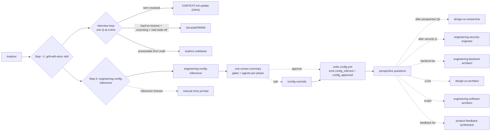
```mermaid
graph LR
    EX["/explore"] --> SM1{Step −1: grill-with-docs skill}
    SM1 --> Q{interview loop<br/>one Q at a time}
    Q -->|term resolved| CTXW["CONTEXT.md update (inline)"]
    Q -->|hard-to-reverse + surprising + real trade-off| ADRW["docs/adr/NNNN"]
    Q -->|answerable from code| CODE[explore codebase]
    SM1 --> S0{Step 0: engineering-config-inferencer}
    S0 --> CI[engineering-config-inferencer]
    CI --> SUMMARY[one-screen summary\ngates + agents-per-phase]
    SUMMARY -.->|approve| WRITE[write config.yml\nemit config_inferred + config_approved]
    SUMMARY -.->|edit| CFG["/config override"]
    CFG --> WRITE
    WRITE --> PERSP[perspective questions]
    PERSP -.->|after perspective Qs| UXR[design-ux-researcher]
    PERSP -.->|after security Q| SE[engineering-security-engineer]
    PERSP -.->|backend kw| BA[engineering-backend-architect]
    PERSP -.->|ui kw| UXA[design-ux-architect]
    PERSP -.->|scope| SA[engineering-software-architect]
    PERSP -.->|feedback kw| FS[product-feedback-synthesizer]
    S0 -.->|inferencer timeout| MANUAL[manual entry prompt]
```

### 5b. `/propose` — spec + design + tasks

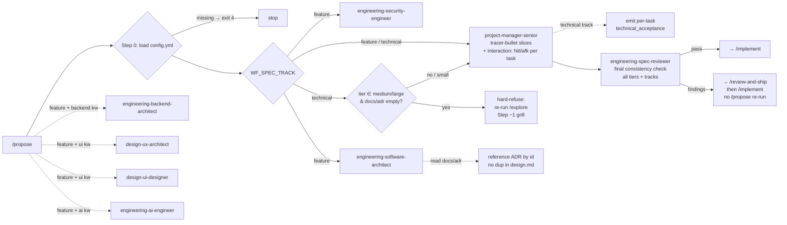
```mermaid
graph LR
    PR["/propose"] --> CFG0{Step 0: load config.yml}
    CFG0 -->|missing → exit 4| STOP_PR[stop]
    CFG0 --> TRK{WF_SPEC_TRACK}
    TRK -->|feature| SE[engineering-security-engineer]
    TRK -->|feature| SA[engineering-software-architect]
    TRK -->|feature / technical| SPM[project-manager-senior<br/>tracer-bullet slices<br/>+ interaction: hitl/afk per task]
    TRK -->|technical| TGATE{tier ∈ medium/large<br/>& docs/adr empty?}
    TGATE -->|yes| STOP_GR[hard-refuse:<br/>re-run /explore<br/>Step −1 grill]
    TGATE -->|no / small| SPM
    SPM -.->|technical track| TA[emit per-task<br/>technical_acceptance]
    SA -.->|read docs/adr| ADRREF[reference ADR by id<br/>no dup in design.md]
    PR -.->|feature + backend kw| BA[engineering-backend-architect]
    PR -.->|feature + ui kw| UXA[design-ux-architect]
    PR -.->|feature + ui kw| UID[design-ui-designer]
    PR -.->|feature + ai kw| AIE[engineering-ai-engineer]
    SPM --> SR[engineering-spec-reviewer<br/>final consistency check<br/>all tiers + tracks]
    SR -->|pass| OK_PR[→ /implement]
    SR -->|findings| RFP[→ /review-and-ship<br/>then /implement<br/>no /propose re-run]
```

### 5c. `/implement` — task execution

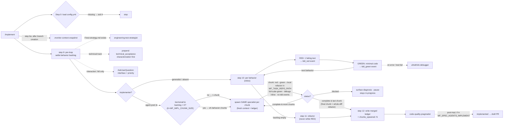
```mermaid
graph LR
    IM["/implement"] --> CFG0{Step 0: load config.yml}
    CFG0 -->|missing → exit 4| STOP_IM[stop]
    IM -->|step 6a: after branch creation| SNAP[.monitor-context-snapshot]
    IM --> S9["step 9: pre-loop<br/>settle behavior backlog"]
    S9 -.->|if test-strategy.md exists| TSG[engineering-test-strategist]
    S9 -.->|technical track| TAP[prepend technical_acceptance<br/>characterization first]
    S9 -.->|interaction: hitl only| HITL[AskUserQuestion:<br/>interface + priority]
    S9 --> IMPL{implementer?}
    IMPL -->|generalist / absent| LOOP["step 10: per behavior (inline)"]
    IMPL -->|agent-pool id| CHUNK{"tier≠small &<br/>backlog > K?<br/>(K=WF_IMPL_CHUNK_SIZE)"}
    CHUNK -->|no → 1 chunk| SPEC
    CHUNK -->|yes → ≤K-behavior chunks| SPEC["spawn SAME specialist per chunk<br/>(fresh context + ledger)"]
    LOOP --> RED["RED: 1 failing test<br/>→ tdd_red event"]
    RED --> GREEN["GREEN: minimal code<br/>→ tdd_green event"]
    GREEN -.->|on error / test fail| UD[ultrathink-debugger]
    GREEN -->|next behavior| LOOP
    LOOP -->|backlog empty| RF["step 11: refactor<br/>(never while RED)"]
    SPEC -->|"chunk: red→green→local refactor in WF_TASK_REPO_PATH<br/>full-suite-green · debugs inline · no tdd events"| SR{status?}
    SR -->|blocked| PAUSE[surface diagnosis · pause<br/>stays in-progress]
    SR -->|"complete & more chunks"| SPEC
    SR -->|"complete & last chunk<br/>(final chunk = whole-diff refactor)"| ST12[step 12: write merged ledger<br/>+ chunks_spawned: N]
    RF --> ST12
    ST12 --> CQP2[code-quality-pragmatist]
    CQP2 -.->|post-impl, if in WF_SPEC_AGENTS_IMPLEMENT| DONE[implemented → draft PR]
```

After step 9 settles the backlog, `/implement` branches on the Task's `implementer:` field (ADR-0004). `generalist` or absent → the inline vertical red-green loop runs in the main session exactly as before (one test then minimal code per behavior; horizontal slicing prohibited per the `tdd` skill; Ultrathink Debugger + `tdd_red`/`tdd_green` events live here). A resolvable agent-pool id → the delegated path (no `tdd_red`/`tdd_green` events). Here `/implement` decides whether to **chunk** (ADR-0018): when `WF_SPEC_TIER != small` **and** `K = WF_IMPL_CHUNK_SIZE > 0` **and** backlog length > K, main cuts the settled ordered backlog into ≤K-behavior chunks and re-spawns the **same** `implementer:` specialist per chunk with fresh context, threading a cumulative `impl_notes` ledger forward; otherwise there is one chunk = the pre-ADR-0018 single delegated spawn. Each chunk runs the full suite (all prior behaviors stay green) and refactors locally; only the **final** chunk performs the closing whole-diff refactor (`git diff task_base_sha..HEAD` + ledger). A chunk returning `complete` with more chunks left re-spawns the specialist; the last chunk's `complete` falls to step 12, which writes the **merged ledger** prefixed with `chunks_spawned: N` (a persisted note-field, not a monitor event). Any chunk returning `blocked` stops the loop and pauses (task stays `in-progress`; prior chunks' green tests remain on disk for `/continue-task`). Both paths converge at step 12; the post-impl quality check, draft PR, and state machine are unchanged. Applies to all tiers — no small-tier exemption (though `small` never chunks: single delegated spawn).

### 5d. `/validate` — validation gates (parallel)

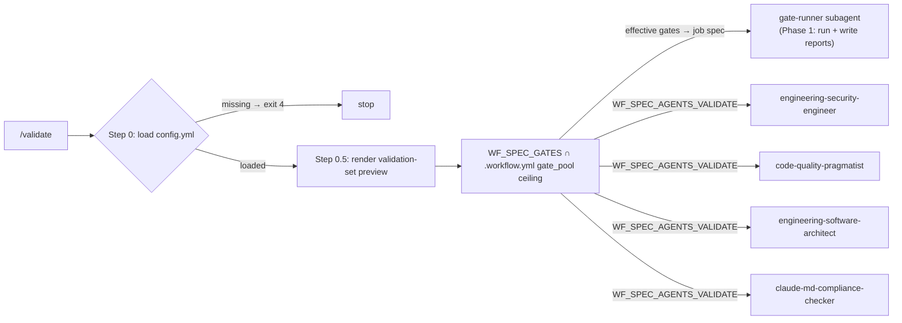
```mermaid
graph LR
    VA["/validate"] --> CFG0{Step 0: load config.yml}
    CFG0 -->|missing → exit 4| STOP_VA[stop]
    CFG0 -->|loaded| APPR[Step 0.5: render validation-set preview]
    APPR --> CEIL["WF_SPEC_GATES ∩ .workflow.yml gate_pool ceiling"]
    CEIL -->|effective gates → job spec| GR["gate-runner subagent<br/>(Phase 1: run + write reports)"]
    CEIL -->|WF_SPEC_AGENTS_VALIDATE| SE[engineering-security-engineer]
    CEIL -->|WF_SPEC_AGENTS_VALIDATE| CQP[code-quality-pragmatist]
    CEIL -->|WF_SPEC_AGENTS_VALIDATE| SA[engineering-software-architect]
    CEIL -->|WF_SPEC_AGENTS_VALIDATE| CMC[claude-md-compliance-checker]
```

### 5e. `/pr-review` — PR comment handling

Self-contained: no config load, no agents, no multi-repo. Resolves the current
branch's PR (or a PR-number arg), classifies each comment `informational | change`,
and walks a per-comment confirm loop posting `[claude]` replies.

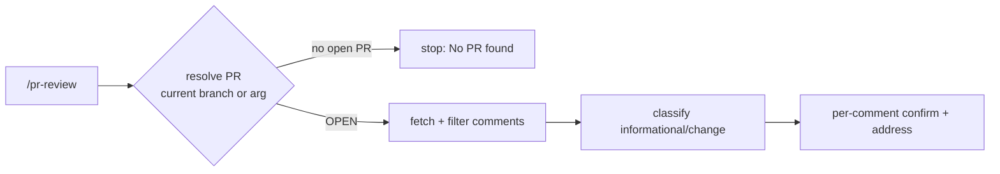
```mermaid
graph LR
    PRR["/pr-review"] --> RESOLVE{resolve PR<br/>current branch or arg}
    RESOLVE -->|no open PR| STOP_PRR[stop: No PR found]
    RESOLVE -->|OPEN| FETCH[fetch + filter comments]
    FETCH --> CLS[classify informational/change]
    CLS --> LOOP[per-comment confirm + address]
```

### 5f. `/validate-impl` — implementation-completion audit

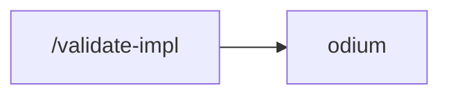
```mermaid
graph LR
    VIMPL["/validate-impl"] --> ODIUM[odium]
```

### 5g. `/review-and-ship` — finding triage + inline ship

```mermaid
graph LR
    RF["/review-and-ship"] --> CFG0{Step 0: load config.yml}
    CFG0 -->|missing → exit 4| STOP_RF[stop]
    CFG0 -->|loaded| PART[partition info / actionable]
    PART --> SPLIT{actionable → AUTO or MANUAL}
    SPLIT -->|category allowlist + sev≤medium + fix_proposal, OR coverage| AUTO[AUTO bucket:<br/>bg agent applies fix /<br/>generates coverage test]
    SPLIT -->|else / spec-audit FR| MANUAL[MANUAL bucket]
    AUTO -->|success| MARK[review_status=accepted<br/>auto_accepted=true<br/>AUTO-FIXED summary]
    AUTO -->|error or test not green| MANUAL
    MANUAL --> TRIAGE[group + per-group<br/>Accept/Reject/Elaborate]
    MARK --> UPD[status update<br/>set-status done + unblock]
    TRIAGE --> UPD
    UPD -->|task was at review| SHIPTAIL([ship procedure inline<br/>one commit · push · PR ready])
    UPD -.->|spec-level reuse: no task at review| NOOP[ship tail no-op]
    SHIPTAIL --> NEXT[→ /learn-from-reports]
    NOOP --> NEXT
```

The AUTO bucket applies mechanical fixes (style/formatting/unused-import/dry-violation) and generates+green-checks coverage tests **before** any human prompt — no commits (working-tree edits, backstopped by the draft PR diff), failures fall back to MANUAL. `/learn-from-reports` skips `auto_accepted` findings when mining KB rules. The ship tail runs only when the current task is at status `review` (the normal per-task finding flow); `/propose` spec-consistency and `/validate-impl` reopen triage reuse this command at the spec level where no task is in `review`, so the tail is a no-op.

### 5h. Ship procedure (inline) — commit, push, PR ready

Not a slash command. The shared prose procedure `scripts/ship-procedure.md`, run inline at the two terminal points of the per-task flow: `/validate`'s zero-findings PASS path and `/review-and-ship`'s tail (task at `review`). `/fix` is the exception — it ships via `/quick-ship`.

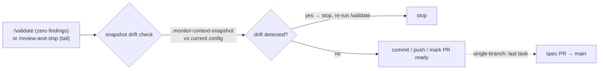
```mermaid
graph LR
    CALLER["/validate (zero findings)<br/>or /review-and-ship (tail)"] --> DRIFT{snapshot drift check}
    DRIFT -->|.monitor-context-snapshot vs current config| DRIFT_DEC{drift detected?}
    DRIFT_DEC -->|yes → stop, re-run /validate| STOP_DRIFT[stop]
    DRIFT_DEC -->|no| COMMIT[commit / push / mark PR ready]
    COMMIT -.->|single-branch: last task| SPECPR[spec PR → main]
```

---

## 6. Hooks

Hooks fire on tool events, orthogonal to commands. Block or monitor every tool call.

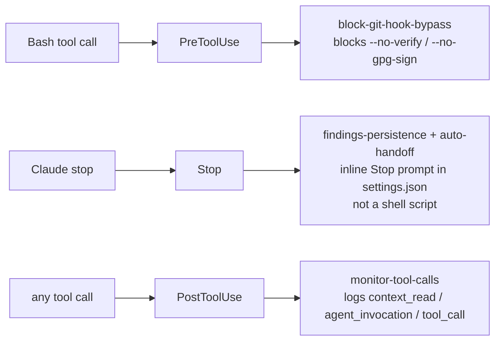
```mermaid
graph LR
    TOOL[Bash tool call] --> PRE[PreToolUse]
    STOP_EVT[Claude stop] --> STOPH[Stop]
    POST_EVT[any tool call] --> POST[PostToolUse]

    PRE --> H1[block-git-hook-bypass<br/>blocks --no-verify / --no-gpg-sign]
    STOPH --> H3[findings-persistence + auto-handoff<br/>inline Stop prompt in settings.json<br/>not a shell script]
    POST --> H4[monitor-tool-calls<br/>logs context_read / agent_invocation / tool_call]
```

Notes:
- `scripts/monitor.sh` writes `specs/$FEATURE/.monitor.jsonl` via direct invocation from `/implement`, not a hook.
- `templates/settings.json` wires `PreToolUse` (Bash), `PostToolUse` (all tools), and `Stop`.
- `hooks/monitor-tool-calls.sh` runs as `PostToolUse` and logs `context_read`, `agent_invocation`, and `tool_call` events to `.monitor.jsonl`.

---

## Key Invariants

- **Serial execution** — one task `in-progress` at a time (gate: per-task = preceding PR merged; single-branch = preceding task `done`)
- **Per-task sequence** — `/implement` → `/pr-review` (optional loop) → `/validate` → (`/review-and-ship` if findings) → `/learn-from-reports` → merge PR, each invoked explicitly by the user. Shipping (commit/push/PR-ready) is a shared inline procedure (`scripts/ship-procedure.md`), not a command — it runs at `/validate`'s zero-findings pass and `/review-and-ship`'s tail, so reaching `done` coincides with shipping. Under `branch_strategy: per-task` (default) `/implement` opens a draft PR and the inline ship marks it ready; under `single-branch` there is no per-task draft PR and `/pr-review` is an inert dead-end mid-spec (see ADR-0003)
- **All-gates** — all configured validation gates (from `WF_SPEC_AGENTS_VALIDATE` ∩ ceiling) must pass before `done`
- **Single KB** — one knowledge base (`$WF_GENERAL_KB`); no project-KB layer (ADR-0002). Feedback loop writes learned rules here.
- **PR shape per `branch_strategy`** — `per-task` (default): one PR per task, base `feat/$FEATURE`. `single-branch`: no per-task PR; one spec PR opened/readied at the final task's inline ship, base `main` (ADR-0003)
- **Ground rules** — bare `$WF_GENERAL_KB`-relative paths (e.g. `security/general.md`). Legacy `general:`/`project:`/`repo:<name>:` prefixes stripped by migration shim + one-time-per-process deprecation warn. Missing `$WF_GENERAL_KB` → exit 7.
- **Vault mode** — `spec_storage_mode: vault` + thin-pointer `.workflow.yml` (workflow settings + `general_kb_path` only; no vault `gate_pool` except self-hosting exception). `spec_storage` uses `{project}` token. Per-spec `repos[]` bind code repos; gates resolve per-task from the bound repo's thin `.workflow.yml gate_pool` (`WF_TASK_REPO_PATH`, `WF_TASK_GATE_POOL`). One task = one repo. PR opens in that repo's remote only. `/bootstrap`: vault-init once + repo-gate-init per target repo.
- **No YAML edits** — all status changes via `task-manager.sh`
- **No bypass** — PreToolUse hook blocks `--no-verify` / `--no-gpg-sign`

## Sources

- `commands/*.md` — command definitions and agent spawns
- `agents/**/*.md` — agent contracts
- `hooks/*.sh` — hook triggers
- `scripts/task-manager.sh` — state machine
- `scripts/monitor.sh` — event logging
- `CLAUDE.md` — design decisions
