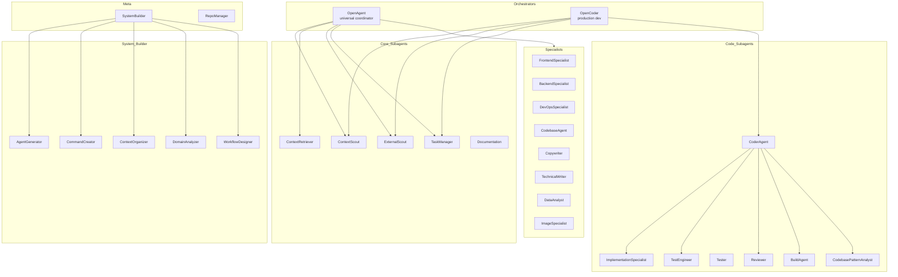
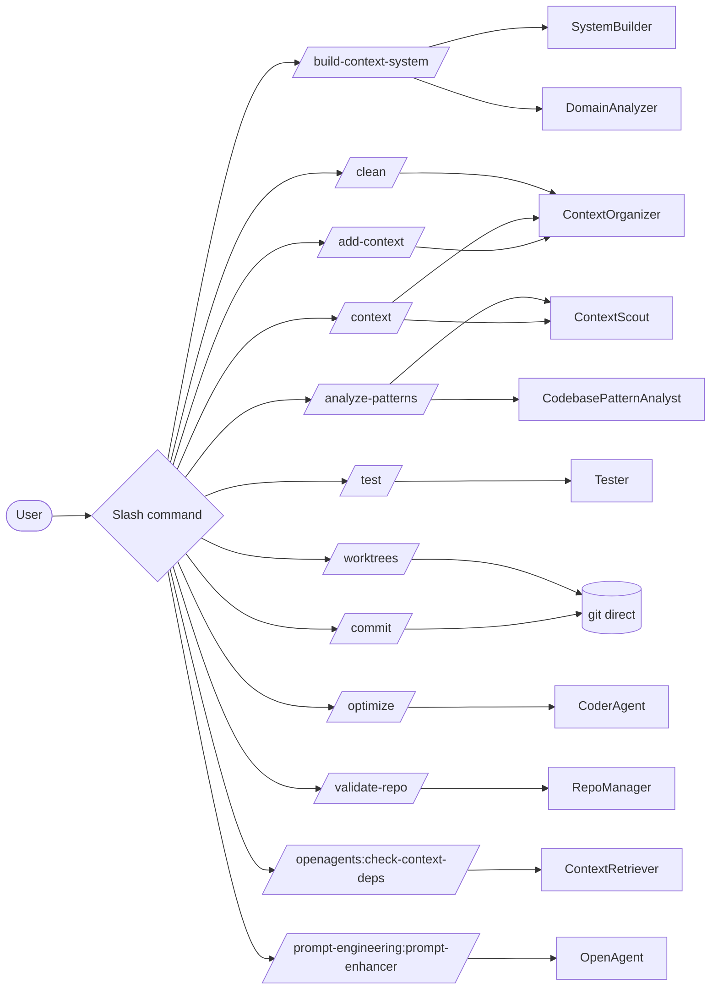
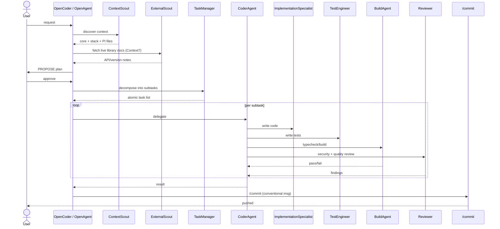
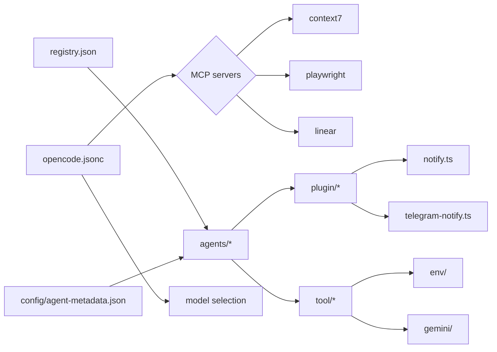

# OpenAgents Control — Agentic Workflow

Visual reference for the **opencode** configuration at `~/.config/opencode/`. Shows how slash commands, orchestrator agents, subagents, context layers, registry, and plugins fit together.

---

## 1. Overview

**OpenAgents Control (OAC)** is a layered agent system on top of [opencode](https://opencode.ai). Two orchestrator agents (`OpenAgent`, `OpenCoder`) coordinate ~28 specialized subagents that load **MVI** (Minimum Viable Intelligence) context — small, scannable knowledge files — before acting. Slash commands are user-facing entry points that bind to one or more agents. A central `registry.json` plus `config/agent-metadata.json` define the catalog.

Core principle: **Context = DNA**. Every non-trivial action begins with `ContextScout` discovering the right context tier (universal → stack → project-intelligence). Local context always wins over global; `project-intelligence/` never falls back to global.

---

## 2. Repository Topology

```mermaid
graph TD
  ROOT[~/.config/opencode]
  ROOT --> AGENT[agent/]
  ROOT --> CMD[command/]
  ROOT --> CTX[context/]
  ROOT --> SKILL[skill/ + skills/]
  ROOT --> PLUG[plugin/]
  ROOT --> TOOL[tool/]
  ROOT --> CFG[config/]
  ROOT --> REG[registry.json]
  ROOT --> OJC[opencode.jsonc]
  ROOT --> TUI[tui.json]
  ROOT --> LIB[_lib/]

  AGENT --> A_CORE[core/ — OpenAgent, OpenCoder]
  AGENT --> A_SUB[subagents/ — core, code, system-builder, development, utils]
  AGENT --> A_DEV[development/ — frontend, backend, devops, codebase-agent]
  AGENT --> A_META[meta/ — system-builder, repo-manager]
  AGENT --> A_CONT[content/]
  AGENT --> A_DATA[data/]
  AGENT --> A_EVAL[eval-runner.md]

  CMD --> C_FLAT[*.md — 10 top-level commands]
  CMD --> C_OA[openagents/check-context-deps]
  CMD --> C_PE[prompt-engineering/prompt-enhancer]

  CTX --> CT_CORE[core/ universal standards]
  CTX --> CT_DEV[development/ stack guides]
  CTX --> CT_PI[project-intelligence/ local-only]
  CTX --> CT_OA[openagents-repo/]
  CTX --> CT_PROJ[project/]
  CTX --> CT_SBT[system-builder-templates/]
  CTX --> CT_TBC[to-be-consumed/]
  CTX --> CT_UI[ui/]
  CTX --> CT_NAV[navigation.md]
  CTX --> CT_DEPS[agent-dependencies.md]

  PLUG --> P_NOTIFY[notify.ts]
  PLUG --> P_TG[telegram-notify.ts]
  TOOL --> T_ENV[env/]
  TOOL --> T_GEM[gemini/]
```

---

## 3. Agent Hierarchy

---

## 4. Slash Commands → Agents

---

## 5. Context Layer Model

Three tiers, resolved in order. Local always wins; `project-intelligence/` never global-fallback.

```mermaid
graph LR
  subgraph Tier1[Tier 1 — core/ universal]
    T1A[standards/<br/>code-quality, docs, tests]
    T1B[workflows/]
    T1C[context-system/<br/>MVI principle]
    T1D[config/, system/, task-management/]
    T1E[essential-patterns.md<br/>visual-development.md]
  end

  subgraph Tier2[Tier 2 — development/ stack]
    T2A[frontend/]
    T2B[backend/]
    T2C[ai/, data/, infrastructure/, integration/]
    T2D[principles/, frameworks/]
    T2E[*-navigation.md<br/>backend, fullstack, ui]
  end

  subgraph Tier3[Tier 3 — project-intelligence/ LOCAL]
    T3A[technical-domain.md]
    T3B[business-domain.md]
    T3C[business-tech-bridge.md]
    T3D[decisions-log.md]
    T3E[living-notes.md]
    T3F[navigation.md]
  end

  NAV[navigation.md<br/>router at each level]
  CS[ContextScout] --> NAV
  NAV --> Tier1
  NAV --> Tier2
  NAV --> Tier3
  Tier3 -. overrides .-> Tier2
  Tier2 -. overrides .-> Tier1
```

Rules:
- Every context file < 200 lines, scannable in < 30 s.
- `navigation.md` exists at each level for fast routing.
- `project-intelligence/` is **never** loaded from global fallback.

---

## 6. End-to-End Workflow

---

## 7. Registry, Config, Plugins, MCP

| Source | Purpose |
|---|---|
| `registry.json` | Single source of truth: categories, profiles, subagents, schema v1.0 |
| `config/agent-metadata.json` | Per-agent: id, name, category, type, version, dependencies (28 entries) |
| `opencode.jsonc` | Model (`kimi-for-coding` / `k2p5`), permissions, MCP servers |
| `tui.json` | UI theme |
| `plugin/notify.ts` | Default desktop notifications |
| `plugin/telegram-notify.ts` | Telegram bot bridge |
| `tool/env/` | Env-variable wrappers |
| `tool/gemini/` | Optional Gemini integration |
| `_lib/telegram-bot.ts` | Legacy TG support |

---

## 8. Skills

Two skill packages exist in **both** `skill/` and `skills/`:

- `task-management/` — CLI for task status, deps, completion (`router.sh`)
- `context7/` — Library registry navigation for Context7 docs

> **WARNING:** `skill/` and `skills/` have **diverged** — they are no longer identical. `diff -rq` shows different content in `SKILL.md`/`SKILLS.MD` (filename mismatch in `context7/`), `router.sh`, and `scripts/task-cli.ts`. Pick one canonical dir, reconcile content, then symlink or delete the other.

---

## 9. Quick Index

- Agents: `agent/**/*.md` — 28 definitions
- Commands: `command/*.md` + `command/openagents/*.md` + `command/prompt-engineering/*.md` — 12 total
- Context tiers: `context/core`, `context/development`, `context/project-intelligence`
- Registry: `registry.json`, `config/agent-metadata.json`
- Entry config: `opencode.jsonc`

Render with any markdown viewer that supports Mermaid (VS Code + *Markdown Preview Mermaid Support*, Obsidian, GitHub).
