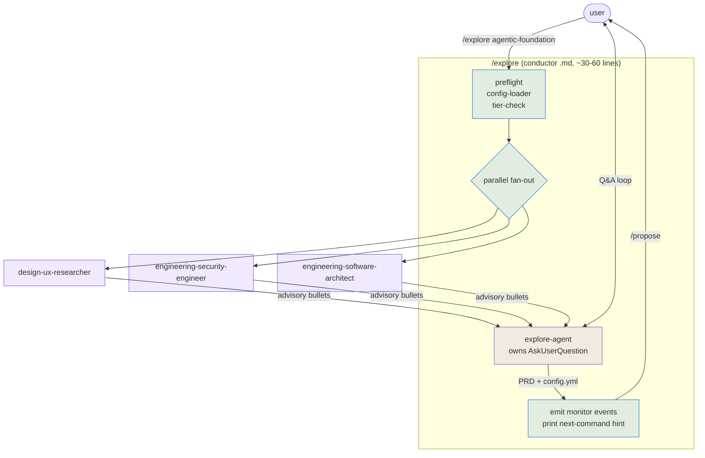
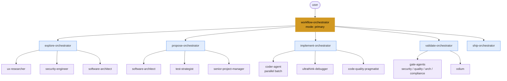
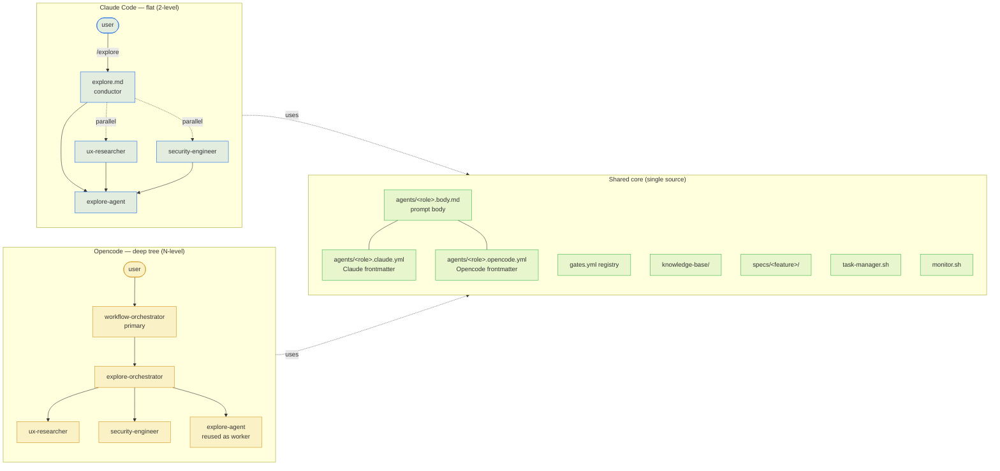

# PRD: Agentic Workflow Foundation

## Problem

Current dev-workflow uses slash commands as orchestrators that spawn specialist agents inline. Three pains compound across a session:

1. **Token bloat.** Each command pumps file reads + advisory-agent outputs into the main context window. Multi-command sessions balloon.
2. **Reuse friction.** KB rule loading, gate execution + parsing, findings accept/reject flow, and advisory rendering all repeat across commands. Some logic lives in scripts; some is duplicated in command markdown.
3. **Hard to add new workflow variants.** Tech-debt, refactor, and audit/compliance flows need different gate sets and shapes; today every variant duplicates the command tree.

A fourth driver pushed scope: **two-runtime support**. The same workflow must run in both Claude Code (flat tree: command → agents) and Opencode (deep tree: primary → orchestrators → workers, verified in `~/.config/opencode/agent/core/opencoder.md`). Claude Code's Agent tool effectively caps at 2 levels of delegation; Opencode's `task()` supports arbitrary depth. A single architecture must map cleanly to both.

## Goal

Move the workflow "as close to agentic as possible" by:

- Pairing each command with a **main agent** (1:1 mapping) that owns the phase's heavy thinking and user Q&A in an isolated context window.
- Slimming each command file to a **thin conductor** (~30–60 lines) that handles deterministic preflight + parallel advisory fan-out + main-agent spawn.
- Mirroring the same logical phases in Opencode as a **single primary `workflow-orchestrator`** with a depth-3 subagent tree.
- Sharing all agent prompt bodies, the gate registry, KB, spec layout, task state machine, and monitor events across both flavors.

Foundation only. Defer new workflow variants (refactor/audit/tech-debt), KB fragment retrieval, and Opencode-specific parallelism optimizations to follow-up specs.

## Users

Primary user: the developer (single-operator) running specs through the workflow. Benefits:

- **Shorter main context** → longer sessions before compaction, lower token spend.
- **Faster iteration on new workflow variants** → variants compose existing main agents + alternative gate sets without rewriting command trees.
- **Single mental model across runtimes** → same agent definitions and artifacts whether running in Claude Code or Opencode.

## Shortest path to value

1. Pilot conversion of `/explore` to conductor + `explore-agent` proves the pattern.
2. Roll same shape across the rest of the command set (≈11 commands).
3. Build Opencode `workflow-orchestrator` reusing the same agent bodies.
4. Wire `setup.sh --claude --opencode --all` for dual install.

## Scope

### In scope

- New main agent per command: `explore-agent`, `propose-agent`, `implement-agent`, `validate-agent`, `pr-review-agent`, `review-findings-agent`, `learn-agent`, `impl-audit-agent`, `ship-agent`, `fix-agent`, `spec-reviewer-agent`.
- Conductor rewrites of corresponding command markdown files (slimmed to orchestration only).
- Opencode `workflow-orchestrator` primary agent + phase orchestrator subagents (`explore-orchestrator`, `propose-orchestrator`, `implement-orchestrator`, `validate-orchestrator`, `ship-orchestrator`, `fix-orchestrator`).
- Split agent file layout: `agents/<role>.body.md` + `agents/<role>.claude.yml` + `agents/<role>.opencode.yml`. Setup script merges per target.
- `scripts/spawn-helpers.sh` exposing `wf_spawn_main_agent`, `wf_spawn_advisory_parallel`, `wf_inject_context`.
- `docs/agent-orchestration.md` documenting the conductor contract and KB-injection convention.
- `tests/test-agent-sync.sh` verifying installed agent sets in both targets match expectations and shared bodies hash-match.
- `setup.sh` flags: `--claude`, `--opencode`, `--all` (default).
- Update `docs/workflow-diagram.md` Mermaid diagrams for both flavors.

### Out of scope (deferred follow-up specs)

- New workflow variants (refactor, audit/compliance, tech-debt).
- KB fragment retrieval (QMD search, per-rule chunking) — only formalize the injection contract.
- Per-task dynamic agent selection beyond current spec-level `agents:` + per-task overrides.
- Opencode BatchExecutor-style parallel coder dispatch.

## Key decisions

- **Sub-spawn collision** (agents-can't-spawn-agents in Claude Code) → **conductor pattern**: command does parallel advisory fan-out, then spawns main agent with advisory outputs in initial prompt. Best isolation, keeps specialists reusable.
- **Q&A ownership** → main agent owns conversation via `AskUserQuestion`. Truly isolates conversational context from command shell.
- **Granularity** → 1:1 main agent per command.
- **Migration** → all commands converted in this single spec; no per-command staged rollout.
- **Variant strategy** (future-facing) → hybrid: core conductor commands + variant-specific add-ons later.
- **Agent file sync** → single body file + per-flavor frontmatter file. Setup script merges.
- **Opencode entry shape** → single primary `workflow-orchestrator`; phase orchestrators are subagents.

## Architecture

### Claude flavor — flat conductor (2-level cap)

Slash commands stay user-invoked. Each command is a thin conductor that fans out advisory specialists in parallel, then spawns its paired main agent with the advisories' outputs in its initial prompt. Main agent owns Q&A. No deeper nesting — Claude Code's Agent tool caps practical delegation at 2 levels.

### Opencode flavor — deep tree (N-level)

Single primary `workflow-orchestrator` replaces all slash commands. Phase orchestrators are subagents that spawn worker specialists via `task()`. Verified in `~/.config/opencode/agent/core/opencoder.md` — OpenCoder → BatchExecutor → CoderAgent is a real 3-level path. Same logical phases as Claude, deeper isolation.

### Side-by-side: same logical phases, different runtime shape

**Key contrast.** Claude command file owns orchestration (fan-out + spawn order). Opencode lifts that responsibility into the `workflow-orchestrator` primary agent — no `.md` slash command needed because the primary agent itself can spawn subagents via `task()`. Both flavors invoke the same body-file prompts; only frontmatter and entry shape differ.

## Ground rules (applicable)

- `general:style/general.md` — bash/markdown style.
- `general:architecture/general.md` — module boundaries, dependency direction.
- `general:testing/principles.md` — test responsibility per task.
- `project:` (any newly added rules during /review-findings).

## Agent Insights (Explore Phase)

Advisory agents were skipped during this exploration session — discussion-mode covered architectural angles directly with the user. Advisory passes (Software Architect, Security Engineer, UX Researcher) deferred to `/propose` where ADRs and trade-off analyses are formally produced.

## Open questions to resolve in /propose

- Exact tool-grant matrix for each main agent (which agents need Edit, Bash, Agent, AskUserQuestion).
- Concrete prompt-body skeleton template (shared shape so all main agents are consistent).
- Whether `scripts/spawn-helpers.sh` should be sourced or invoked as subshell helpers.
- Test harness shape for verifying conductor→agent contracts (dry-run mode?).
- Backwards-compat strategy for in-flight specs created under current (non-conductor) commands.

## Verification target (high-level)

- All existing bash tests still pass unchanged.
- A full feature run through `/explore → /propose → /implement → /validate → /ship` works end-to-end on both Claude and Opencode flavors.
- Sync test confirms shared agent bodies are byte-identical across installs.
- Monitor JSONL captures phase transitions and agent spawns for both flavors.

## Next command

`/propose agentic-foundation`
