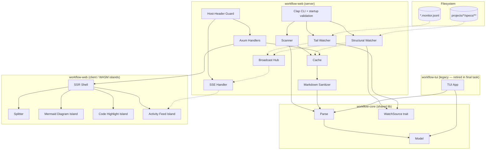
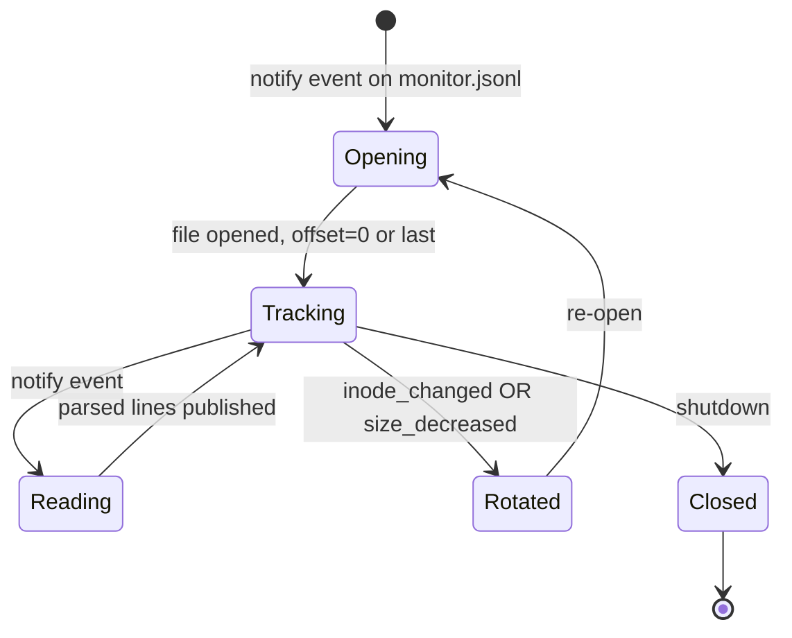
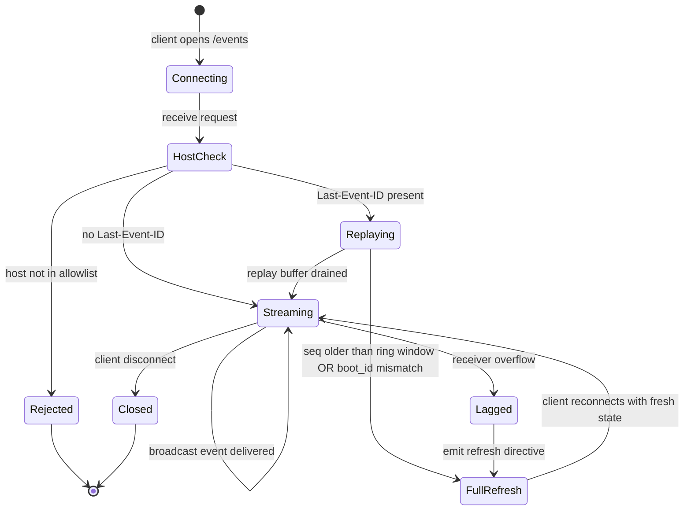
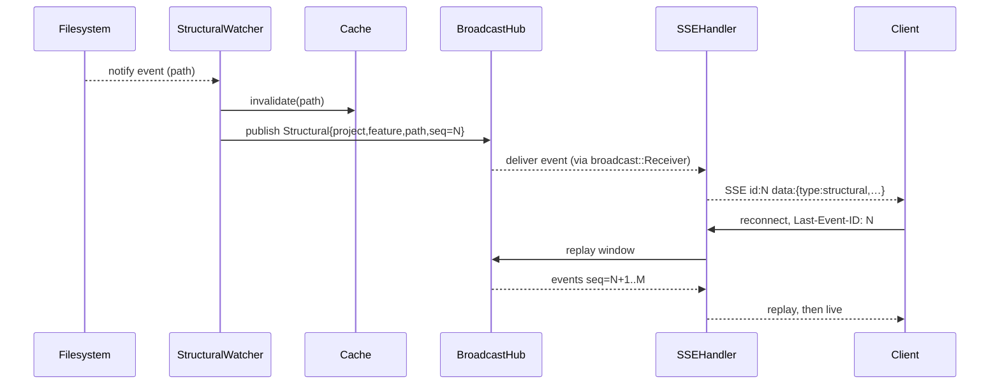

# Design — workflow-web-ui

## Architecture Overview

Three-crate Cargo workspace at repo root:

- `workflow-core/` — shared library: `model/`, `parse/`, `WatchSource` trait, `WatchEvent` enum. Consumed by both TUI and web.
- `workflow-web/` — Leptos SSR + Axum fullstack binary (`workflow-web <root>`). Server: handlers, SSE, two watchers, cache, sanitizer, broadcast hub. Client: SSR shell + WASM islands (Mermaid, shiki, activity feed).
- `workflow-tui/` — legacy ratatui TUI; migrated to consume `workflow-core`, retired in final task.

Concurrency: lock-free `Arc<AppState>` over `DashMap`-backed cache + per-project `tokio::sync::broadcast` topics. No global `RwLock`. Handlers read cache; watchers invalidate cache and publish to broadcast hub; SSE handler streams from broadcast receiver with replay buffer for `Last-Event-ID` resume.

Trust boundary: all markdown sanitized server-side on cache fill (`pulldown-cmark` → `ammonia`). Cache stores both parsed model and sanitized HTML. Templates emit HTML via `inner_html` only at this single sink. Frontmatter scalars rendered as text.



## Architecture Decision Records

### ADR-001: Extract `workflow-core` shared library

**Status:** Proposed.

**Context:** TUI and web dashboard both consume `specs/<feature>/` artifacts and `.monitor.jsonl`. Duplicating model + parser logic would diverge them quickly. Watcher abstraction differs across UIs but watched events are identical.

**Decision:** New crate `workflow-core` at workspace root containing `model/` (spec, task, report, monitor_event), `parse/` (scanner, task_parser, report_parser, monitor_parser, frontmatter, warning), and `WatchSource` trait + `WatchEvent` enum. Notify-based implementations stay in consumers. TUI's `src/model/` and `src/parse/` deleted and re-imported from `workflow_core::{model, parse}`.

**Consequences:** Parser changes ship to both UIs at once. Cross-crate refactor must land before web crate begins. Aligns with `general:architecture/general.md` (clear interfaces, dep direction UIs→core) and `project:languages/rust.md` layer-separation.

**Trade-off:** chose `workflow-core` over narrower `workflow-parser` to keep the `WatchSource` abstraction co-located with the models it emits, at the cost of a slightly larger extraction surface.

### ADR-002: Root Cargo workspace

**Status:** Proposed.

**Context:** Three crates share types, deps, and `Cargo.lock`. `cargo-leptos` drives a workspace member.

**Decision:** Repo-root `Cargo.toml` with `[workspace] members = ["workflow-core","workflow-web","workflow-tui"]` + `[workspace.dependencies]` for shared crates (serde, anyhow, tokio, tracing). Existing `workflow-tui/Cargo.toml` migrated to use workspace deps. Cargo aliases (`cargo tui`, `cargo web`) added in `.cargo/config.toml`.

**Consequences:** Single `cargo check`; atomic version bumps; one `target/`. Contributors must understand workspace semantics. CLAUDE.md Build & Run section updated in same PR.

**Trade-off:** chose root workspace over nested-under-TUI to keep web crate non-orphan once TUI is retired.

### ADR-003: Parser cache `DashMap` keyed by `(mtime, len)`

**Status:** Proposed.

**Context:** Parsing 50+ spec files per request is wasteful. Cache must support concurrent reads (handlers) and concurrent writes (watcher invalidation, lazy fill).

**Decision:** `Cache = Arc<DashMap<PathBuf, CacheEntry>>` where `CacheEntry { mtime, len, parsed: ParsedArtifact, html: Option<String> }`. Reads: stat file, compare `(mtime, len)`, return cached on hit; else reparse + sanitize + insert. Watcher invalidation removes entries by path. No size bound (bounded by repo file count). Periodic sweep removes entries whose path no longer exists.

**Consequences:** Lock-free reads. Adds `dashmap` (justified: small, no heavy transitive deps). Aligns with `general:languages/rust/concurrency.md` (fine-grained sync over global mutex). `moka` rejected — revisit only if cache size becomes measured problem.

**Trade-off:** mtime granularity (1s on some FS) covered by adding `len` as tie-breaker.

### ADR-004: Two watchers — debounced structural + tail for `.monitor.jsonl`

**Status:** Proposed.

**Context:** Structural files change rarely and benefit from debouncing. `.monitor.jsonl` is append-only and wants sub-second latency.

**Decision:** Watcher A: `notify-debouncer-mini`, 100–250 ms window, subscribes to `projects/*/specs/**` excluding `.monitor.jsonl`, emits `WatchEvent::Structural(path)`. Watcher B: per-monitor-file tail tracker `(inode, byte_offset)`; on raw notify event reads delta and emits `WatchEvent::MonitorAppend(project, feature, events)`. Inode change OR size decrease → re-open from offset 0 (handles vim atomic-rename save). Both publish to per-project broadcast channels.

**Consequences:** Each watcher tuned to access pattern. Two notify subscriptions. Tail watcher must handle file rotation. Aligns with `project:languages/rust.md` debounce rule while preserving live-feed UX. State diagram below.



### ADR-005: Per-project `broadcast` topics with seq + replay buffer

**Status:** Proposed.

**Context:** SSE clients subscribe per project. Reconnects must resume from `Last-Event-ID`. Slow clients must not starve fast ones.

**Decision:** `BroadcastHub { topics: DashMap<ProjectId, broadcast::Sender<Event>>, seq: DashMap<ProjectId, AtomicU64>, replay: DashMap<ProjectId, RingBuffer<Event>>, boot_id: Uuid }`. Each event tagged with monotonic per-project seq. Replay ring window ≥ 256. SSE handler reads `Last-Event-ID`, if seq within window replays then attaches; if outside window emits `{type:"reset"}`; if `boot_id` mismatches also emits `reset`. Channel capacity 256; `Lagged(n)` → emit `{type:"lag", dropped:n}` then continue.

**Consequences:** Per-topic fan-out scales linearly with subscribers. Adds `tokio-stream` (justified: SSE adapter). Lifecycle diagram:



### ADR-006: Custom splitter component, persisted in `localStorage`

**Status:** Proposed.

**Context:** Resizable panes with persisted sizes is a small focused primitive. JS splitter libs introduce Leptos interop friction; Leptos-native splitter crates are thin.

**Decision:** `<Splitter direction=… persist_key=…>` Leptos component, CSS grid `grid-template-{cols,rows}` with fractional units, pointer-down/move/up updates a signal, debounced (100ms) write to `localStorage` under key `workflow-web.panes`. Keyboard resize via ArrowLeft/Right (or Up/Down) when divider focused; `role="separator"` + `aria-valuenow`.

**Consequences:** Zero JS dep. ~150 LOC. a11y in v1 (acceptance criteria). Aligns with `general:architecture/general.md` small-module rule.

### ADR-007: SSR shell + WASM islands

**Status:** Proposed.

**Context:** Mermaid + shiki are large client-side libs. SSE is inherently client-side. Spec/task/report views benefit from SSR first-paint.

**Decision:** Leptos SSR mode. Shell + spec/task/report views server-rendered. `<MermaidDiagram>`, `<CodeHighlight>`, `<ActivityFeed>` are islands hydrated client-side, lazy-loaded (dynamic import for mermaid + shiki). Server embeds cache `seq` into initial HTML; islands compare on hydrate, trigger refresh if mismatch.

**Consequences:** Fast first paint. Heavy JS only where it earns weight. Two mental models (SSR vs island). Adds `leptos`, `leptos_axum`, `axum`, `tower-http` (PRD-mandated). Aligns with `general:architecture/general.md` boundary validation.

### ADR-008: Markdown sanitized server-side, cached as HTML

**Status:** Proposed.

**Context:** Markdown authored by humans (and LLMs); must not introduce XSS even on loopback. Sanitization is non-trivial CPU.

**Decision:** Pipeline: `pulldown-cmark` → HTML → `ammonia::Builder` with strict allowlist (tags/attrs in spec SEC-FR-8). Sanitized HTML stored in cache entry. Templates emit via `inner_html` only at this sink. Cache invalidation drops parsed + HTML together.

**Consequences:** One sanitization per file version. Trust boundary at cache write. Larger cache entries. Adds `pulldown-cmark`, `ammonia` (justified: de-facto Rust standards). Aligns with `general:architecture/general.md` "validate at boundaries."

### ADR-009: Lock-free shared state, no global RwLock

**Status:** Proposed.

**Context:** Handlers (read-heavy, many), watchers (write cache invalidations, few), SSE fan-out (broadcast). Global `RwLock` would serialize them.

**Decision:** `Arc<AppState { cache: Arc<Cache>, hub: Arc<BroadcastHub>, config: Arc<Config> }>`. DashMap inside cache and hub. No `RwLock`. Tasks own no shared mutable state beyond Arc handles; communicate via channels.

**Consequences:** Handlers don't block on watchers. Read-after-invalidate may cause a reparse (acceptable). Aligns with `general:languages/rust/concurrency.md` and `general:languages/rust/ownership.md`.

### ADR-010: Clap-derive CLI with fail-closed startup validation

**Status:** Proposed.

**Context:** Misconfiguration must fail loudly, not silently expose to network.

**Decision:** Clap derive: positional `root: PathBuf`, `--bind: IpAddr` (default `127.0.0.1`), `--port: u16` (default 8787), `--allowed-host: Vec<String>` (repeatable, default `localhost`/`127.0.0.1`/`[::1]`), `--log: tracing::Level` (default `info`). Startup invariants before `bind()`: (1) root exists+dir, (2) `root/projects/` exists, (3) bind addr `is_loopback()`, (4) allowed-host non-empty. Exit codes: 0 ok, 2 bad CLI, 4 invariant fail, 7 path missing. Host-header allowlist via `tower-http::validate_request` layer.

**Consequences:** Failure modes explicit. Loopback default hard to misconfigure. Adds `tracing`, `tracing-subscriber`, `tokio`, `tower-http` (justified). Aligns with `general:architecture/api-design.md` (predictable status/exit codes) and `general:architecture/general.md` (validate at boundaries).

## Backend Design

### Module decomposition (`workflow-web/src/`)

```
src/
├── main.rs                  -- clap, startup validation, axum::serve
├── config.rs                -- Config struct, validate_invariants()
├── app_state.rs             -- AppState (Arc fields)
├── cache.rs                 -- Cache, CacheEntry, get_or_load(), invalidate()
├── sanitize.rs              -- pulldown_cmark + ammonia pipeline
├── scanner.rs               -- cold-scan projects/*/specs/**
├── watcher/
│   ├── mod.rs               -- spawn both watchers
│   ├── structural.rs        -- notify-debouncer-mini
│   └── tail.rs              -- monitor.jsonl tail
├── broadcast/
│   ├── mod.rs               -- BroadcastHub
│   ├── event.rs             -- Event { type, project, feature, path, seq }
│   └── replay.rs            -- RingBuffer
├── api/
│   ├── mod.rs               -- router assembly
│   ├── error.rs             -- ApiErrorResponse, ErrorCode
│   ├── path_guard.rs        -- segment allowlist + canonicalize + symlink reject
│   ├── projects.rs          -- GET /api/projects
│   ├── specs.rs             -- GET /api/spec/{project}/{feature}/{path}
│   ├── tasks.rs             -- GET /api/task/{project}/{feature}/{id}
│   ├── reports.rs           -- GET /api/report/{project}/{feature}/{name}
│   ├── monitor.rs           -- GET /api/monitor/{project}/{feature}?offset=
│   ├── editor.rs            -- GET /api/open-in-editor/... -> vscode:// URI
│   └── events.rs            -- GET /events?project=
├── ui/                      -- Leptos SSR components
│   ├── shell.rs
│   ├── splitter.rs
│   ├── spec_list.rs
│   ├── task_detail.rs
│   ├── report_cards.rs
│   ├── dep_graph.rs         -- mermaid source emit
│   └── activity_feed.rs
└── islands/                 -- WASM islands (mermaid, shiki, sse)
    ├── mermaid.rs
    ├── highlight.rs
    └── sse_feed.rs
```

Module size target < 100 LOC where feasible per `general:architecture/general.md`.

### API contracts

Response envelope follows `general:architecture/api-design.md`:
```json
{ "data": …, "meta": { "seq": N, "boot_id": "uuid" } }
{ "error": { "code": "invalid_path", "message": "…" } }
```

| Method | Path | Response |
|---|---|---|
| GET | `/api/projects` | `{data:[{name, spec_count}]}` |
| GET | `/api/specs?project=<p>` | `{data:[{feature, status, task_count}]}` |
| GET | `/api/spec/{project}/{feature}/{kind}` | `{data:{frontmatter, html, raw_seq}}` where `kind ∈ {spec,design,prd,config}` |
| GET | `/api/task/{project}/{feature}/{id}` | `{data:{frontmatter, html, status, blocked_by}}` |
| GET | `/api/tasks/{project}/{feature}` | `{data:[{id, name, status, blocked_by}]}` for dep graph |
| GET | `/api/report/{project}/{feature}/{name}` | `{data:{findings:[…]}}` |
| GET | `/api/monitor/{project}/{feature}?offset=<u64>&limit=<u32>` | `{data:{events:[…], next_offset, truncated}}` |
| GET | `/api/open-in-editor?project=&feature=&path=&line=` | `{data:{href:"vscode://file/…:N"}}` |
| GET | `/events?project=<p>` | SSE stream: `event: {structural\|monitor_append\|lag\|reset}\ndata: {…}\nid: <seq>\n\n` |

Status codes: 200 success, 400 invalid_path/host, 404 not_found, 413 too_large, 429 rate_limit, 503 sse_full, 500 internal. All bodies use envelope.

### SSE event schema

```rust
#[derive(Serialize)]
#[serde(tag = "type", rename_all = "snake_case")]
enum Event {
    Structural { project: String, feature: String, path: String, seq: u64 },
    MonitorAppend { project: String, feature: String, events: Vec<MonitorEvent>, seq: u64 },
    Lag { dropped: u64, seq: u64 },
    Reset { boot_id: Uuid },
}
```

Service interaction:



### Handler pattern

Per `general:languages/rust/api-layer.md`:

```rust
#[instrument(name = "[Get Task]", skip(state))]
pub async fn get_task_handler(
    State(state): State<Arc<AppState>>,
    Path((project, feature, id)): Path<(String, String, String)>,
) -> Result<Json<ApiResponse<TaskDto>>, ApiErrorResponse> {
    let path = path_guard::resolve(&state.config.root, &project, &feature, "tasks", &id)?;
    let entry = state.cache.get_or_load(&path).await?;
    Ok(Json(ApiResponse::ok(TaskDto::from(entry))))
}
```

Path guard runs first; cache load is fail-soft (returns ApiErrorResponse mapped from domain `CoreError` via `From`).

### Error model

`workflow-core::CoreError` (thiserror enum: `NotFound`, `Parse`, `Io`, `InvalidPath`).
`workflow-web::ApiErrorResponse` wraps `ErrorCode` enum (`NotFound`, `InvalidPath`, `TooLarge`, `BlockedHost`, `RateLimit`, `SseFull`, `Internal`). `impl IntoResponse` maps to `(StatusCode, Json)`. `tracing::error!` logs full detail server-side; response carries only `{code, message}`.

### Cargo dependencies (workflow-web)

| Crate | Justification |
|---|---|
| `axum` | Tokio HTTP framework; canonical Leptos SSR partner. |
| `leptos`, `leptos_axum` | PRD-mandated SSR. |
| `tower-http` | Host-header validate, tracing, body-limit, timeout middleware. |
| `tower-governor` | Rate limit (loopback 100 r/s burst 200). |
| `tokio` | Async runtime. |
| `tokio-stream` | Broadcast → SSE Stream adapter. |
| `tracing`, `tracing-subscriber` | Structured logs + redaction. |
| `dashmap` | Lock-free cache + hub topic map. |
| `pulldown-cmark` | CommonMark parse. |
| `ammonia` | HTML sanitize (Rust standard). |
| `notify`, `notify-debouncer-mini` | Already approved in TUI. |
| `serde`, `serde_json`, `serde_yml` | Already approved. |
| `clap`, `anyhow`, `thiserror` | CLI + error idiom. |
| `uuid` | `boot_id`. |

Versions pinned `=x.y.z` for security-sensitive crates (SEC-FR-25). `cargo-audit` + `cargo-deny` gates in CI.

## Frontend Architecture

### Component hierarchy (Leptos SSR + islands)

```
<App>
└── <Shell>                            -- SSR
    ├── <TopBar>                       -- SSR (project switcher, theme toggle)
    └── <Splitter direction="horiz">   -- SSR component, client interactivity
        ├── <SpecListPane>             -- SSR
        │   └── <SpecItem*>            -- SSR
        └── <Splitter direction="vert">
            ├── <DetailPane>           -- SSR
            │   ├── <TaskDetail>       -- SSR (inner_html sanitized)
            │   │   └── <CodeHighlight island>
            │   ├── <DepGraphView>     -- SSR shell
            │   │   └── <MermaidDiagram island>
            │   └── <ReportCards>      -- SSR
            │       └── <CodeHighlight island>
            └── <ActivityFeed island>  -- WASM, SSE consumer
```

State ownership: `Shell` owns route + active project (URL-driven). `Splitter` owns its fraction signal, persists to `localStorage`. `ActivityFeed` owns SSE connection + ring buffer of recent events. `MermaidDiagram` and `CodeHighlight` are pure functions of props (source string).

### Layout framework

- CSS Grid `grid-template-{cols,rows}: <fraction>fr 4px <fraction>fr`; the 4px gutter is the splitter handle.
- Responsive breakpoints: dashboard targets desktop; below 800px width panes collapse to tabs (deferred to v2 unless trivial).
- Tailwind via `cargo-leptos`. CSS variable tokens defined in `style/tokens.css`:
  ```
  --bg-base, --bg-elevated, --fg-default, --fg-muted,
  --accent, --warn, --error, --border, --code-bg
  ```
  Dark-mode default; `[data-theme="light"]` overrides.

### Design-system integration

No prior design system. New tokens live in `workflow-web/style/tokens.css` and are the single source. Future Tailwind config reads from these CSS vars.

### Splitter persistence schema

```json
{ "panes": { "root-horiz": 0.25, "detail-vert": 0.70 }, "version": 1 }
```

Stored under `localStorage["workflow-web.panes"]`. Versioning enables future migration.

## UI Specifications

(Minimal — no UI Designer agent spawned per `WF_SPEC_AGENTS_PROPOSE`. Specs below derived directly from PRD + ground rules.)

- **States** for interactive elements: default, hover, focus-visible (clear ring), active, disabled.
- **Splitter handle:** 4px wide; expands to 8px hit zone via `::before`; `cursor: col-resize` / `row-resize`; `role="separator"`, `aria-valuemin=0`, `aria-valuemax=1`, `aria-valuenow=<fraction>`.
- **Status badges:** color coded `todo` (muted), `in-progress` (accent), `implemented` (warn-soft), `review` (warn), `done` (success), `blocked` (error). Contrast ≥ WCAG AA on both themes.
- **Code blocks:** monospace; `var(--code-bg)`; shiki tokens preserved.
- **Finding cards:** code snippet (collapsed by default if > 20 lines, expand toggle); rationale/impact/references sections; severity ribbon left edge.
- **Mermaid:** rendered inside sandboxed iframe; resizable via container; SVG inherits theme via CSS vars passed as iframe query string.
- **a11y:** keyboard navigation throughout; splitter resizable via Arrow keys when focused; landmark roles (`<nav>`, `<main>`, `<aside>`).

## Risk Flags

| Severity | Risk | Mitigation |
|---|---|---|
| HIGH | `workflow-core` extraction must land cleanly before web crate begins | First task moves model+parse wholesale with passing TUI; second task adds `WatchSource`; only then start web |
| HIGH | Tail watcher inode tracking fragile across editor atomic-rename save | On any notify event re-open from offset; `(inode_changed OR size_decreased)` → reset offset to 0; integration test exercises vim save |
| MED | SSE ring buffer (256) vs watcher storms (git checkout) | Debouncer coalesces before channel; measure under git-checkout in integration test; tune if needed |
| MED | SSR/island hydration mismatch on edit-during-load | Embed cache `seq` in initial HTML; islands compare on hydrate, refresh on mismatch |
| MED | Workspace migration breaks contributor muscle memory | Update CLAUDE.md same PR; cargo aliases |
| LOW | DashMap unbounded growth | Periodic sweep removes paths that no longer exist; defer `moka` |
| LOW | Splitter a11y skipped under time pressure | Acceptance criteria; Playwright keyboard-resize test |
| LOW | Mermaid + shiki bundle bloat | Lazy-loaded islands; Playwright network assertion |

## References

- PRD: `specs/workflow-web-ui/prd.md`
- KB: `~/.claude/knowledge-base/{security,architecture,languages/rust,testing}/`
- Project KB: `knowledge-base/languages/rust.md`
- Existing TUI: `workflow-tui/src/{model,parse,watcher,ui}/`
- Mermaid style conventions: `docs/workflow-diagram.md`
