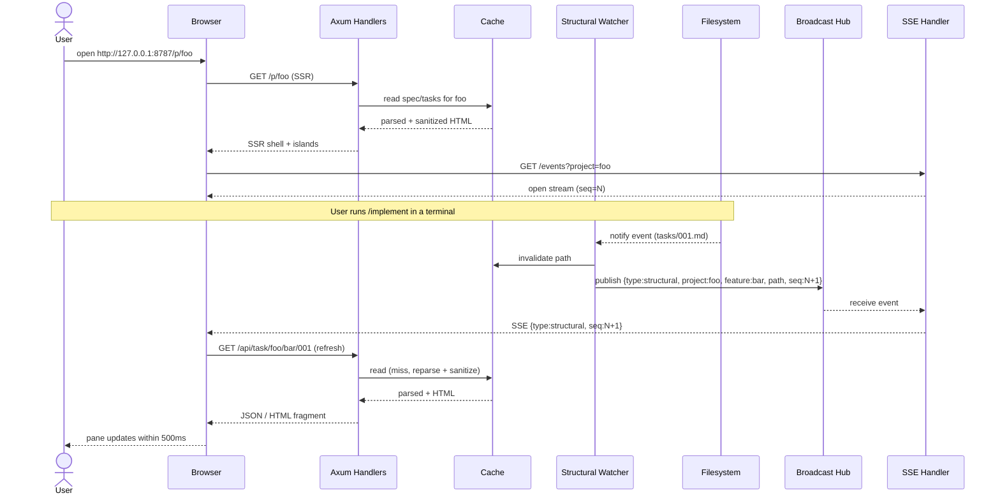

# Spec — workflow-web-ui

## Overview

Replace the cramped Rust TUI (`workflow-tui/`) with a web dashboard that mirrors current data and scales to ~100 specs / 1k tasks across multiple projects under a master-brain root. Single binary `workflow-web <root>`, Leptos SSR + Axum fullstack, bound to `127.0.0.1`, no auth, read-only. Live updates via SSE backed by `notify` file-watcher. Rich content (Mermaid, code highlighting, finding cards) rendered properly.

## Goals

- G1. Multi-pane resizable web UI with persisted pane sizes, dark mode default.
- G2. Multi-project discovery from one master-brain root.
- G3. Spec/task/report/dep-graph/activity-feed views with live updates.
- G4. Rich rendering: sanitized markdown, Mermaid diagrams (client), syntax-highlighted code (shiki).
- G5. Read-only, localhost-only, hardened against XSS / path traversal / DNS rebinding / DoS.
- G6. Retire `workflow-tui/` after parity reached.

## Non-Goals (v1)

- Global or per-spec search (v2).
- Write paths or workflow command triggering from UI.
- Multi-user, auth, LAN access.
- Stakeholder/PM views, export, sharing.

## Functional Requirements

### Discovery & Navigation

- **FR-1.** Server takes positional `<root>` arg; scans `<root>/projects/*/specs/<feature>/{prd.md, spec.md, design.md, tasks/*.md, reports/*.{md,yml}, .monitor.jsonl, config.yml}` at boot.
- **FR-2.** Project switcher in UI; one project active at a time. Switching is a route change (`/p/<project>`).
- **FR-3.** Spec list pane shows all specs in active project with status badge derived from task aggregate.
- **FR-4.** Task detail pane shows frontmatter (table) + body (sanitized markdown) + current status.
- **FR-5.** Report view renders finding cards with: code snippet, fix proposal, rationale, impact, references, confidence (LLM only). Mirrors `/review-findings` card model.
- **FR-6.** Dep-graph pane renders Mermaid graph of inter-task `blocked_by` edges per spec.
- **FR-7.** Activity feed pane streams `.monitor.jsonl` events with type, timestamp, summary; tailing, not snapshot.

### Layout & Theme

- **FR-8.** Multi-pane resizable layout (CSS-grid splitter, drag + keyboard). Pane sizes persisted in `localStorage` keyed `{pane_id → fraction}`.
- **FR-9.** Dark mode default. Theme via CSS variable tokens. Tailwind via `cargo-leptos`.

### Live Updates

- **FR-10.** Server exposes `GET /events?project=<p>` (SSE) emitting `{type, project, feature, path, seq}` with monotonic per-project `seq`.
- **FR-11.** Client supports `Last-Event-ID` resume from the per-project ring buffer (window ≥ 256 events).
- **FR-12.** On receiver lag, server emits `{type:"lag", dropped:N}` and client triggers full refresh.
- **FR-13.** File events debounced/coalesced (≥100ms, ≤250ms) per canonical path before reaching the broadcast channel; per-path rate cap 20 events/s.
- **FR-14.** `.monitor.jsonl` watched by dedicated tail watcher with byte-offset cursor; appends emit `MonitorAppend` events with parsed lines (not raw bytes).

### Rich Rendering

- **FR-15.** Markdown rendered server-side via `pulldown-cmark` → `ammonia` sanitize → HTML cached alongside parsed model. Template embeds sanitized HTML.
- **FR-16.** Mermaid blocks rendered client-side via `mermaid.js` in a WASM island, inside `<iframe sandbox="allow-scripts">` with `securityLevel: 'strict'`.
- **FR-17.** Code blocks highlighted client-side via `shiki` island; grammars + themes ship bundled (no dynamic load).
- **FR-18.** Frontmatter scalars rendered as text only (never HTML); Leptos default escaping. No `inner_html` outside the single sanitized-markdown sink.

### Open in Editor

- **FR-19.** "Open in editor" buttons emit server-constructed `vscode://file/<abs_path>[:line[:col]]` URIs only. No query / fragment. Author-supplied `vscode:` links in spec content stripped by ammonia.

### Caching & Performance

- **FR-20.** Parser cache `DashMap<PathBuf, CacheEntry>` keyed by `(mtime, len)`. Cache hit returns ready HTML + parsed model. Watcher invalidation removes entries.
- **FR-21.** Cold scan of 100 specs completes <500ms on warm filesystem (target, not blocking).

### Process & CLI

- **FR-22.** Clap derive CLI: positional `<root>`, `--bind 127.0.0.1`, `--port 8787`, `--allowed-host <host>` (repeatable, default `localhost`/`127.0.0.1`/`[::1]`), `--log <level>`.
- **FR-23.** Startup invariants validated before `bind()`: root exists and is dir; `root/projects/` exists; bind addr is loopback; allowed-host list non-empty. Exit codes: 0 ok, 2 bad CLI, 4 invariant fail, 7 path missing.

### Retire TUI

- **FR-24.** After web reaches parity, `workflow-tui/` crate is deleted; root README + CLAUDE.md updated; shared `workflow-core` remains.

## Security Requirements

Numbered for traceability. Derived from STRIDE analysis.

- **SEC-FR-1 (Loopback only).** Exactly one socket on `127.0.0.1:<port>` (and optionally `[::1]:<port>`). Non-loopback bind → startup exit 2.
- **SEC-FR-2 (Host allowlist).** Tower middleware rejects requests whose `Host` ∉ allowlist with `400` + `decision=blocked_host` log. Applies to all routes including SSE and static.
- **SEC-FR-3 (CORS).** `Access-Control-Allow-Origin` echoes allowlisted origins only; no `*`; no credentials.
- **SEC-FR-4 (Segment allowlist).** Path params and each `/`-split segment match `^[A-Za-z0-9._-]{1,128}$`, not `.` or `..`; NUL rejected.
- **SEC-FR-5 (Canonicalize + ancestor check).** Resolved path canonicalized and MUST satisfy `canonical.starts_with(canonical_root)`. Failure → `400 {code:"invalid_path"}`.
- **SEC-FR-6 (Symlink policy).** Any symlink anywhere from root down to target → `400`, `decision=blocked_symlink`.
- **SEC-FR-7 (Extension allowlist).** Served file extensions ∈ `{.md, .yml, .yaml, .jsonl}`; else `404 {code:"not_found"}`.
- **SEC-FR-8 (Markdown sanitize).** Ammonia strict allowlist: tags `{p,h1..h6,ul,ol,li,strong,em,code,pre,blockquote,a,table,thead,tbody,tr,th,td,hr,br,img,span,div}`, attrs `{href,src,alt,title,class,id,colspan,rowspan}`, `url_schemes ∈ {http,https,mailto}`, `url_relative=Deny`, no `data:`, no `script/style/iframe/object/embed`, no `on*`, no `srcdoc`.
- **SEC-FR-9 (Frontmatter is text).** No `inner_html` on frontmatter-derived values. CI grep gate forbids `inner_html` outside the sanitized-markdown sink.
- **SEC-FR-10 (vscode URI construction).** Server-side only. Shape `^vscode://file/[^?#]+(?::\d+){0,2}$`. Query/fragment forbidden. Ammonia strips author-supplied `vscode:` URLs.
- **SEC-FR-11 (Mermaid sandbox).** `securityLevel: 'strict'` inside `<iframe sandbox="allow-scripts">` (no `allow-same-origin`). Server caps mermaid block source at 16 KiB.
- **SEC-FR-12 (CSP).** `default-src 'self'; script-src 'self' 'wasm-unsafe-eval'; style-src 'self' 'unsafe-inline'; img-src 'self' data:; connect-src 'self'; frame-src 'self'; frame-ancestors 'none'; base-uri 'self'; form-action 'none'; object-src 'none'`. Plus `X-Content-Type-Options: nosniff`, `X-Frame-Options: DENY`, `Referrer-Policy: no-referrer`, `Permissions-Policy: camera=(), microphone=(), geolocation=()`.
- **SEC-FR-13 (File size cap).** Markdown/YAML ≤ 2 MiB; JSONL window ≤ 1 MiB. Over-cap → `413 {code:"too_large", limit:N}`.
- **SEC-FR-14 (JSONL line cap).** Per-line ≤ 64 KiB. Oversized → skip + counter + synthetic `{type:"parse_skip"}`.
- **SEC-FR-15 (SSE backpressure).** Per-client broadcast queue ≤ 256. On lag emit `{type:"lag", dropped:n}`. Concurrent SSE clients ≤ 32 → `503 Retry-After: 1`.
- **SEC-FR-16 (Watcher debounce).** ≥100ms debounce per canonical path; per-path rate cap 20/s.
- **SEC-FR-17 (Request timeouts).** Header read 5s; non-SSE request total 30s; body limit 16 KiB.
- **SEC-FR-18 (Rate limit).** 100 req/s burst 200 via tower-governor.
- **SEC-FR-19 (No content/secret logs).** No file contents, request bodies, or absolute paths in logs. Paths relative to root. Redaction layer scrubs `sk-…`, `ghp_…`, `xox[bap]-…`, JWT, AWS keys.
- **SEC-FR-20 (Generic error responses).** All 4xx/5xx use `{code, message}` from fixed enum. Internal `Debug`/`Display` never cross boundary.
- **SEC-FR-21 (Decision logging).** Blocked requests log `decision ∈ {blocked_host, blocked_traversal, blocked_symlink, blocked_size, blocked_ratelimit}` with relative attempt path.
- **SEC-FR-22 (Validate-at-startup).** Root canonicalized once at boot. Unreadable / symlink root → exit 2.
- **SEC-FR-23 (No secret env vars).** No env var matching `*_TOKEN|*_KEY|*_SECRET|*_PASSWORD` read. Allowed: `WORKFLOW_UI_PORT`, `WORKFLOW_UI_ROOT`.
- **SEC-FR-24 (Read-only contract).** Zero `POST/PUT/PATCH/DELETE` handlers. CI gate: `rg -n '\.route\(.*(post|put|patch|delete)' workflow-web/src/` non-zero match → fail.
- **SEC-FR-25 (Pinned deps).** `=x.y.z` for `ammonia`, `pulldown-cmark`, `axum`, `tower-http`, `notify`, `serde_yml`. `cargo-audit` + `cargo-deny` green pre-merge.

## BDD Scenarios

### Discovery & Navigation

```gherkin
Scenario: Boot scans master-brain root
  Given root /m/b containing projects/foo/specs/bar/spec.md
  When workflow-web /m/b starts
  Then the spec list for project foo includes feature bar
  And status badge reflects task aggregate

Scenario: Project switcher routes
  Given two projects foo and baz
  When the user clicks baz in the switcher
  Then the route is /p/baz
  And the spec list reflects baz's specs

Scenario: Task detail shows frontmatter + body
  Given task tasks/001-foo.md exists
  When the user opens it
  Then the response renders the frontmatter as a table
  And the body as sanitized HTML
  And the status badge matches task frontmatter status
```

### Layout & Persistence

```gherkin
Scenario: Pane sizes persist across reload
  Given the user drags the spec/task divider to 30/70
  When the user reloads the page
  Then the divider restores to 30/70
  And the localStorage key holds the saved fraction

Scenario: Keyboard resize of pane
  Given the splitter divider has focus
  When the user presses ArrowRight
  Then the right pane shrinks by one step
  And the new fraction persists
```

### Live Updates

```gherkin
Scenario: Spec file save triggers SSE event
  Given a client connected to /events?project=foo
  When projects/foo/specs/bar/spec.md is saved
  Then within 500ms an SSE event arrives with type=structural, project=foo, feature=bar
  And seq is monotonic vs prior events for project foo

Scenario: Last-Event-ID resume within ring window
  Given the client disconnects after seq=42
  And the ring buffer holds seq 30..50
  When the client reconnects with Last-Event-ID: 42
  Then events with seq>42 are replayed in order before live streaming resumes

Scenario: Last-Event-ID resume outside ring window
  Given Last-Event-ID predates the ring buffer
  When the client reconnects
  Then the server emits {type:"reset"} and starts fresh

Scenario: Slow client receives lag notice
  Given the watcher emits 1000 events while the client is paused
  When the client resumes
  Then it first receives {type:"lag", dropped:N}
  And subsequent events resume in seq order

Scenario: monitor.jsonl append streams parsed events
  Given client connected to /events?project=foo
  When .monitor.jsonl for foo/bar gets a new JSON line
  Then within 200ms an SSE MonitorAppend event arrives with the parsed event payload
  And raw bytes are not transmitted
```

### Rich Rendering

```gherkin
Scenario: Markdown renders sanitized HTML
  Given a spec contains a code block and a heading
  When the task detail is fetched
  Then the response HTML contains the heading
  And the code block is wrapped in <pre><code>
  And the response originated from the cached sanitized HTML

Scenario: Mermaid block renders in sandboxed island
  Given a design.md contains a ```mermaid graph TB``` block
  When the page loads in a browser
  Then the diagram is rendered inside <iframe sandbox="allow-scripts">
  And the iframe has no allow-same-origin

Scenario: Code highlighting hydrates on island
  Given a task body has a fenced rust code block
  When the page hydrates
  Then the code block has shiki-applied token classes
```

### Open in Editor

```gherkin
Scenario: Open-in-editor URI is server-constructed
  Given task file at projects/foo/specs/bar/tasks/001.md line 12
  When the user clicks the open-in-editor button
  Then the href matches ^vscode://file/[^?#]+:12$
  And contains no query or fragment
```

## Security Scenarios

### Path traversal & symlink

```gherkin
Scenario: Reject parent-directory traversal
  When the client GETs /api/spec/foo/bar/../../etc/passwd
  Then status is 400
  And body is {"code":"invalid_path"}
  And a log entry has decision=blocked_traversal
  And /etc/passwd is not read

Scenario: Reject URL-encoded traversal
  When the client GETs /api/spec/foo/bar/%2e%2e%2f%2e%2e%2fetc%2fpasswd
  Then status is 400
  And decision=blocked_traversal is logged

Scenario: Reject NUL byte injection
  When the client GETs /api/spec/foo/bar/notes.md%00.png
  Then status is 400

Scenario: Reject symlink escaping root
  Given projects/foo/specs/bar/secret.md is a symlink to /etc/passwd
  When the client GETs /api/spec/foo/bar/secret.md
  Then status is 400
  And decision=blocked_symlink is logged
```

### Host header / DNS rebinding

```gherkin
Scenario: Reject foreign Host header
  When GET / is sent with Host: attacker.example
  Then status is 400
  And decision=blocked_host is logged

Scenario: Accept localhost host
  When GET / is sent with Host: localhost:<port>
  Then status is 200
```

### Stored XSS

```gherkin
Scenario: Script tags in markdown are stripped
  Given a spec contains "<script>alert(1)</script>" and ""
  When the page is fetched
  Then the response contains no "<script" substring
  And contains no "onerror=" attribute
  And contains no "javascript:" URL

Scenario: Author-supplied vscode: links are stripped
  Given a spec contains "[pwn](vscode://vscode.git/clone?url=http://evil)"
  When the page is fetched
  Then no anchor with href starting "vscode:" appears

Scenario: Frontmatter scalar is HTML-escaped
  Given a spec frontmatter description: ""
  When the sidebar card is rendered
  Then the HTML contains "&lt;img" not "<img"
```

### Resource limits

```gherkin
Scenario: Oversized markdown returns 413
  Given specs/foo/bar/huge.md is 5 MiB
  When the client GETs it
  Then status is 413
  And body is {"code":"too_large","limit":2097152}

Scenario: JSONL tail capped at 1 MiB
  Given .monitor.jsonl is 50 MiB
  When the client GETs the tail
  Then at most 1 MiB is returned
  And response includes truncated=true and next_offset

Scenario: Oversized JSONL line is skipped
  Given .monitor.jsonl contains a 128 KiB line
  When the tail is fetched
  Then the oversized line is omitted
  And a {"type":"parse_skip"} sentinel appears

Scenario: SSE client cap enforced
  Given 32 SSE clients are already connected
  When a 33rd client opens /events
  Then the response is 503 with Retry-After: 1
```

### Loopback bind & read-only

```gherkin
Scenario: Reject non-loopback bind
  When the binary starts with --bind 0.0.0.0
  Then the process exits with code 4
  And stderr contains "bind must be loopback"

Scenario: No write methods registered
  When the router is inspected at startup
  Then no POST/PUT/PATCH/DELETE handler exists
  And the CI grep gate passes
```

### Error opacity

```gherkin
Scenario: Internal IO error is masked
  Given a file unreadable due to OS permission
  When the client GETs it
  Then response is {"code":"not_found"} status 404
  And the server log contains the full os error with errno
```

## User Flow

Primary happy-path: solo dev keeps the dashboard open while running `/implement` in a terminal; a task file is saved; the task detail pane reflects the new content within 500ms.



## Applicable Ground Rules

- `general:security/general.md`
- `general:architecture/general.md`
- `general:architecture/api-design.md`
- `general:languages/rust/_index.md`
- `general:languages/rust/api-layer.md`
- `general:languages/rust/error-handling.md`
- `general:languages/rust/concurrency.md`
- `general:languages/rust/ownership.md`
- `general:testing/principles.md`
- `project:languages/rust.md`
